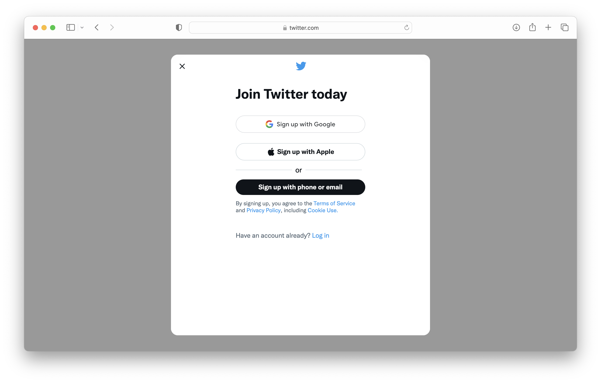
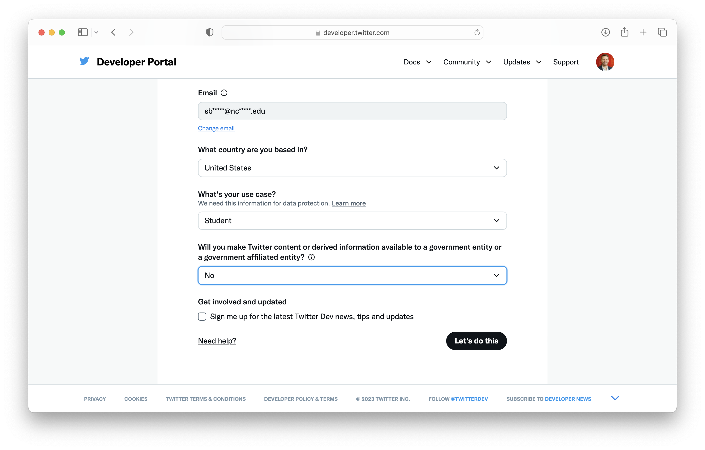
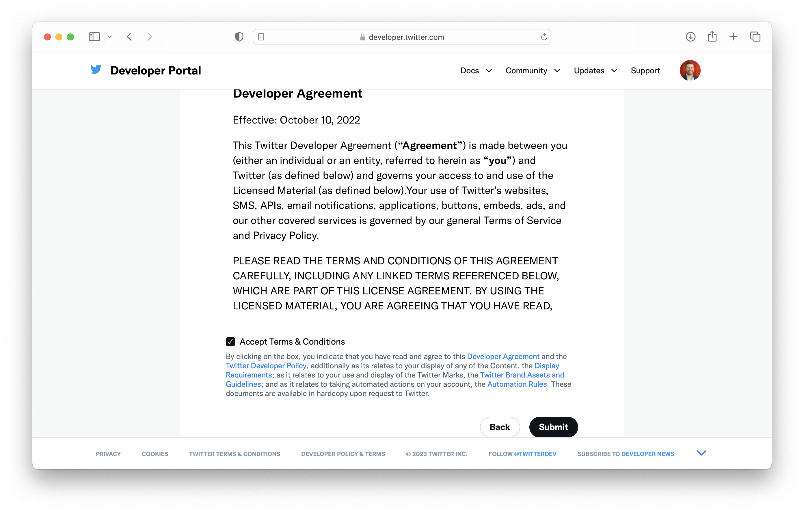
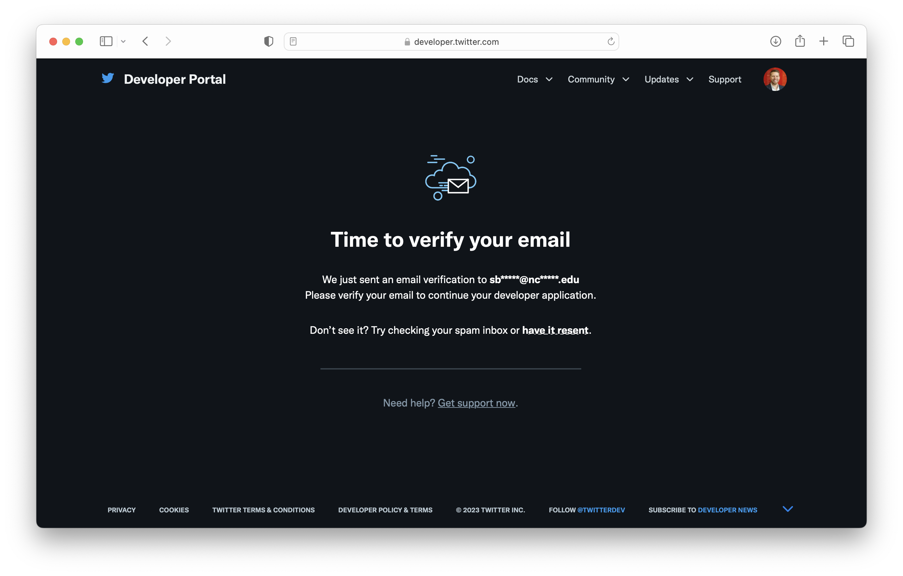
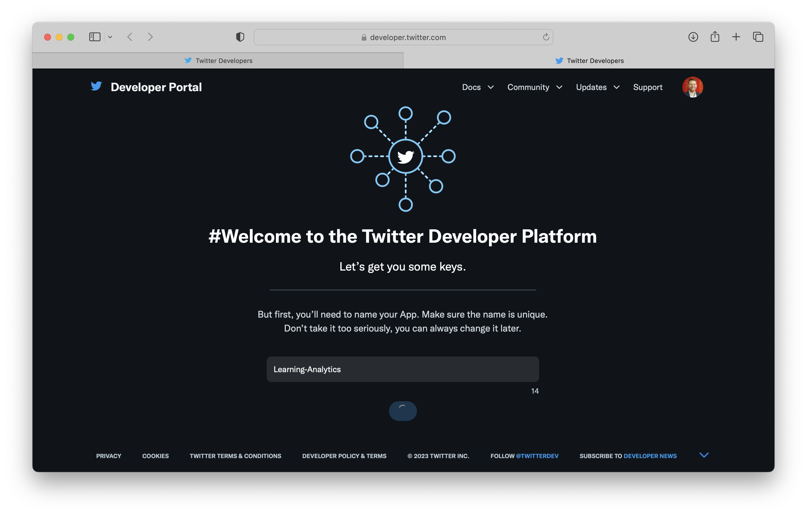
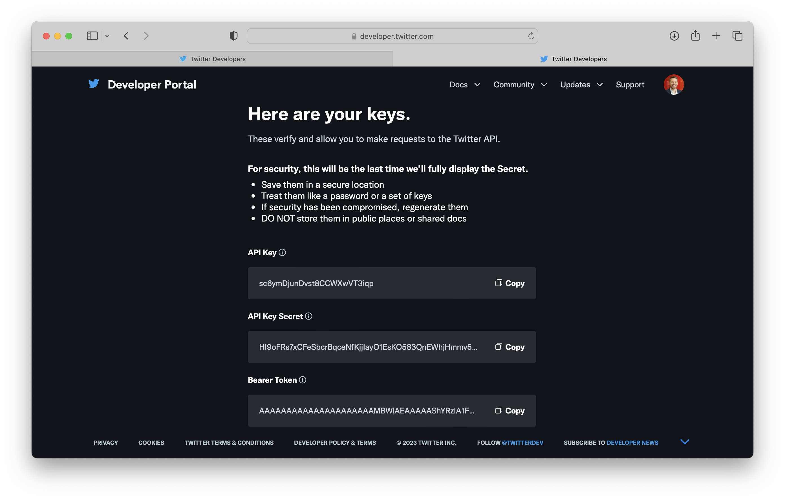

```{r setup, include=FALSE}
knitr::opts_chunk$set(echo = TRUE)
```

## Introduction

In Unit 3, you'll learn how the Twitter Application Programming Interface (API) was used to examine public sentiment around the Common Core and Next Generation Science Standards. The Twitter API facilitates analyses like the by providing companies, developers, and researchers with programmatic access to publicly available data.

### What is an API?

For those new to the concept of an API, our very own Raleigh, NC-based [Red Hat](https://www.redhat.com/en/topics/api/what-are-application-programming-interfaces) describes an API as a means for one product or service communicate with other products and services:

> APIs are sometimes thought of as contracts, with documentation that represents an agreement between parties: If party 1 sends a remote request structured a particular way, this is how party 2's software will respond.

As Duke University's Chris Bail notes, "APIs have become one of the most important ways to access and transfer data online--- and increasingly APIs can even analyze your data as well." Compared to screen-scraping data from web pages, APIs ensure that data is collected legally, and with R packages like `rtweet`, they are considerably easier to work with than HTML or XML data scraped from the web.

For a more in-depth explanation of APIs, how they work, and a preview of some of the `rtweet` functions we'll be using this summer, I highly recommend reading through Chris Bail's [Application Programming Interfaces in R](https://sicss.io/2020/materials/day2-digital-trace-data/apis/rmarkdown/Application_Programming_interfaces.html) tutorial.

## Create a Developer Account

### Log in or Sign Up for Twitter

In order to use Twitter's API, you will need to set up a Twitter developer account, which requires a have a regular twitter account. :

1.  Go to [twitter.com](https://twitter.com/) and log in or sign up for an account that you you would use for development.

{width="80%"}

### Sign-Up for a Standard Developer Account

2.  Sign up for access to the Twitter API by going to [developers.twitter.com](https://developer.twitter.com/en/apply-for-access) and clicking on the "Sign up" link.

{width="80%"}

3.  On the next page, click the `Apply for a developer account` button.

{width="80%"}

4.  Next, you'll be asked to confirm and provide some developer information, including a developer account #UseCase.

    -   For this course, **I recommend selecting `Student` as your use case and indicating "No" to facilitate approval.**

{width="80%"}

-   Later in this guide, you will also apply for [Elevated Access](https://developer.twitter.com/en/docs/twitter-api/getting-started/about-twitter-api), which we will need to make use of the [rtweet package](https://github.com/ropensci/rtweet#rtweet-) for retrieving data through the Twitter API in R. And should you determine after the course that you would like to use the Twitter API for your own research, I highly recommend applying for an [Academic Research](https://developer.twitter.com/en/solutions/academic-research) account which provides an even greater level of access to data.

5.  Click the `Let's do this` button to submit a standard application.

6.  Next, you'll be prompted to Accept the Terms and Conditions of developer agreement. Check the box and click submit.

{width="80%"}

7.  Verify your email.

{width="80%"}

8.   Congrats, you just become a become an official Twitter Developer!! Next, you be prompted to create and name your first "app." We won't actually be creating an app, but we will need the credentials twitter will provide next for using the Twitter API to request data.

    -   In the prompt provide, give you app any name you like.

{width="80%"}

9.  Finally, you will be provide with the "keys" to your app. Copy these and store them in a safe place.

{width="80%"}

### Sign-Up for an Elevated Developer Account

1.  Below are some suggestions below for each of the questions you'll be asked:

    -   In English, please describe how you plan to use Twitter data and/or APIs. The more detailed the response, the easier it is to review and approve.

        -   You should definitely include that you will be using twitter data as part of the Learning Analytics in STEM Education Research Institute, a professional development program for early and mid-career researchers hosted by North Carolina State University. We'll be using the Twitter API for instructional purposes and will be collecting and analyze data related to tweets containing hashtags specific to education topics such as #CommonCore as well as tweets by educational leaders in various fields.

    -   Are you planning to analyze Twitter data?

        -   Select "Yes."
        -   Analyses we'll perform will be primarily focus word counts and sentiment analysis in order to understand and compare key topics and terms surrounding specific hashtags and tweets by education leaders.

    -   Will your app use Tweet, Retweet, Like, Follow, or Direct Message functionality? Please describe your planned use of these features.

        -   Select "No."

    -   Do you plan to display Tweets or aggregate data about Twitter content outside Twitter? Please describe how and where Tweets and/or data about Twitter content will be displayed outside of Twitter.

        -   Select "Yes."
        -   Analysis of Twitter data described above will be incorporated into informal data reports and shared with other students and the workshop instructors through the LASER Institute's private RStudio workspace. 

    -   Will your product, service, or analysis make Twitter content or derived information available to a government entity?

        -   Select "No."

2.  Read through the guidelines before submitting your applications. [Sumedh Patkar](https://dev.to/sumedhpatkar/beginners-guide-how-to-apply-for-a-twitter-developer-account-1kh7) has provide an excellent summary these guidelines which I've copied below:

    -   **Reverse Engineering** - Don't try to reverse engineer the Twitter API. Do not try to sell, lease, distribute, or provide access to any licensed material to a third-party.
    -   **Security** - Never give away your account's API keys (The ones which you generate after creating an app)
    -   **Rate limits** - Don't call the Twitter API endpoints beyond the specified rate limits. In short, *don't spam*. The rate limits of individual endpoints can be found in [Twitter API reference](https://developer.twitter.com/en/docs/api-reference-index).
    -   **Location Data** - This data can only be used to identify the tagged location of Twitter content like tweets, retweets, DMs, and more.
    -   **Use of Twitter Marks** - Don't use the Twitter Logo for this account
    -   **Automation Guidelines** - Automated liking, automated bulk following, and automated adding to lists or collections are discouraged.

3.  Review and submit your application. Once you have submitted you can't make changes so make sure everything is complete and correct.

    -   You may be asked follow up questions in an email so I recommend printing to PDF or taking a screenshot of your application so you can review the responses you submitted.

4.  Wait for an email from Twitter that should arrive in the next few days that either:

    -   Approves your developer application
    -   Rejects your application
    -   Provide additional information before approval.

5.  Once your application is approved you can now using the Twitter API. and proceed to the following section!

## Create a Twitter App

Before you can begin pulling tweets into R, you'll first need to create a Twitter App in your developer account. This section is borrowed largely from the `rtweet` package by Michael Kearney, and requires that you have set up a Twitter developer account.

Follow the steps below to set up your app:

1.  Navigate to [developer.twitter.com/en/apps](https://developer.twitter.com/en/apps/), click the blue button that says, `Create a New App`, and then complete the form with the following fields:

    -   `App Name`: What your app will be called

    -   `Application Description`: How your app will be described to its users

{width="80%"}

-   `Website URLs`: Website associated with app

    -   I recommend using the URL to your Twitter profile

-   `Callback URLs`: *IMPORTANT* enter exactly the following: \`[http://127.0.0.1:1410\`](http://127.0.0.1:1410%60)


-   `Tell us how this app will be used`: Be clear and honest


2.  When you've completed the required form fields, click the blue `Create` button at the bottom

3.  Read through and indicate whether you accept the developer terms


4.  And you're done!


