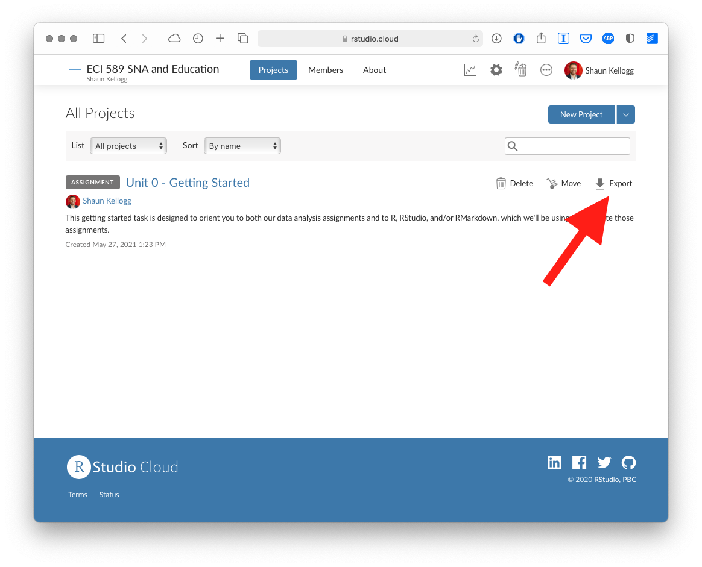

```{r setup, include=FALSE}
knitr::opts_chunk$set(echo = TRUE, error = FALSE)
```

## 0. INTRODUCTION

### Background

Welcome to using ECI 519 SNA in Education! During the second week of
each unit, we'll "walk through" a basic research workflow, or data
analysis process, that will focus on a basic analysis using social
network analysis techniques that you'll be expected to apply during an
independent analysis. This getting started task is designed to orient
you to both our data analysis assignments and to R, RStudio, and/or
RMarkdown, which we'll be using to complete those assignments.

I'll be using RStudio Cloud, which has all of the functionality of the
desktop version of RStudio, and some additional benefits for the those
new to R, such as the installation of packages and the simplification of
file directories. If you're new to R, I highly recommend it.

You are also welcome to use RStudio desktop, and you can download this
project on our course workspace by clicking the "Export" button shown in
the following screenshot:

{width="80%"}

### Organization

This independent practice is really a warm-up. It is a chance to become
familiar with how RStudio works. In the context of doing so, we'll focus
on three things:

1.  Reading data into R (in the **Prepare** section)
2.  Preparing and "wrangling" data in table (think spreadsheet!) format
    (in the **Wrangle** section)
3.  Creating some plots (in the **Explore** section)
4.  Running a model - specifically, a regression model (in the **Model**
    section)
5.  Finally, creating a reproducible report of your work you can share
    with others (in the **Communicate** section)

You may be wondering what these bolded terms refer to; what's so special
about preparing, wrangling, exploring, and modeling data - and
communicating results? We're using these terms as a part of a framework,
or workflow, that comes from the work of Krumm et al.'s [*Learning
Analytics Goes to
School*](https://www.routledge.com/Learning-Analytics-Goes-to-School-A-Collaborative-Approach-to-Improving/Krumm-Means-Bienkowski/p/book/9781138121836)*.*

You can check that out (literally, it's [available online through the
NCSU Library](https://catalog.lib.ncsu.edu/catalog/NCSU4862134)), but
don't feel any need to dive deep for now - we'll be spending more time
on this process throughout the course. For now, know that this document
is organized around these five components of the Data Intensive Research
Workflow.

Click the arrow to the right of the code chunk below to view the image
(more on that process of clicking the green arrow and what it does, too,
in a moment)!

```{r}
knitr::include_graphics("img/laser-cycle.png")
```

### How to use this document

This is an R Notebook. There are two keys to your use of it:

1.  First, be sure that you are viewing the document in the "Visual
    Editor" mode. You can use this mode by clicking the symbol that
    appears like a letter A (or the tip of a pencil!) in the top right
    of this window.
2.  Second, click "Preview" at the top of this screen to preview the
    document as you work through it. This will allow you to see your
    code and the input in a rendered - easy-to-read - document.

Let's get started!

## 1. PREPARE

By preparing, we refer to developing a question or purpose for the
analysis, which you likely know from your research can be difficult!
This part of the process also involves developing an understanding of
the data and what you may need to analyze the data. Often this involves
looking at the data and its documentation. For now, we'll focus on just
a few parts of this process, diving in much more deeply over the coming
weeks.

### Packages 📦

R uses "packages," add-ons that enhance its functionality. One package
that we'll be using is the tidyverse. The {tidyverse} package is
actually a [collection of R](https://www.tidyverse.org/packages)
packages designed for reading, wrangling, and exploring data and which
all share an underlying design philosophy, grammar, and data structures.

Before we can begin using these packages, we will need to install them
using the `install.packages()` function built into R.

Click the green arrow in the right corner of the block-or "chunk"-of
code that follows and see if you can identify which packages have been
installed in the console below.

```{r, eval=FALSE}
install.packages("tidyverse")
```

Once these packages have been installed, we will need to load them in
order to use the handy functions they contain.

To load the tidyverse, click the green arrow in the right corner of the
block-or "chunk"-of code that follows. Notice that we do not need to use
the quotation marks again because the {tidyverse} package and packages
it contains are now a part of our package library!

```{r}
library(tidyverse)
```

Please do not worry if you saw a number of messages: those probably mean
that the tidyverse loaded just fine. If you see an error, though, try to
interpret or search via your search engine the contents of the error, or
reach out to us for assistance.

### Loading (or reading in) data

Next, we'll load data - specifically, a CSV file, the kind that you can
export from Microsoft Excel or Google Sheets - into R, using the
`read_csv()` function in the next chunk.

Clicking the green arrow runs the code; do that next.

```{r}
d <- read_csv("data/sci-online-classes.csv")
```

Notice that we "assigned" our data set to a new object in R named `d`
that will now be saved in your environment pane in the upper right
corner of RStudio. Go ahead and take a look to make sure it's there.

#### [**Your Turn**]{style="color: green;"} **⤵**

Why do you think we included `data/` before our `sci-online-classes.csv`
file? Why quotation marks?

Add your responses after the dashes below:

\-

Hint: check the files pane in the lower right corner of RStudio.

#### Viewing or inspecting data

Last, let's check that the code worked as we intended; run the next
chunk and look at the results, tabbing left or right with the arrows, or
scanning through the rows by clicking the numbers at the bottom of the
pane with the print-out of the data you loaded:

```{r}
d
```

#### [**Your Turn**]{style="color: green;"} **⤵**

What do you notice about this dataset? What do you wonder? Add one or
two thoughts after the dash below:

\-

There are other ways to inspect your data; the `glimpse()` function
provides one such way. Run the code below to take a glimpse at your
data.

```{r}
glimpse(d)
```

Generally, rows typically represent "cases," the units that we measure,
or the units on which we collect data. What counts as a "case" (and
therefore what is represented as a row) varies by (and within) fields.
There may be multiple types or levels of units studied in your field;
listing more than one is fine! Also, please consider what columns -
which usually represent variables - represent in your area of work
and/or research.

#### [**Your Turn**]{style="color: green;"} **⤵**

How many "cases" or observations are in this data set?

\-

Pick two columns (or more) and write what you think it represents:

\-

\-

Next, we'll use a few functions that are handy for preparing data in
table form.

## 2. WRANGLE

By wrangle, we refer to the process of cleaning and processing data,
and, in cases, merging (or joining) data from multiple sources. Often,
this part of the process is very (surprisingly) time-intensive.
Wrangling your data into shape can itself be an important
accomplishment! There are great tools in R to do this, especially
through the use of the {dplyr} R package.

### Selecting variables

Let's select only a few variables by typing our dataset `d` and
"passing" that using the `%>%` operator to the `select()` function from
the {dplyr} package:

```{r}
d %>% 
  select(student_id, total_points_possible, total_points_earned, TimeSpent)
```

Notice how the number of columns (variables) is now different.

Let's *include one additional variable* in your select function.

First, we need to figure out what variables exist in our dataset (or be
reminded of this - it's very common in R to be continually checking and
inspecting your data)!

In addition to `glimpse()` function, you can use a function named
`View()` to do this. Try it out and see what happens!

```{r, eval=FALSE}
View(d)
```

#### [**Your Turn**]{style="color: green;"} **⤵**

In the code chunk below, add a new variable to the code, being careful
to type the new variable name as it appears in the data. I've added some
code to get you started. Consider how the names of the other variables
are separated as you think about how to add an additional variable to
this code.

```{r}
d %>% 
  select(student_id, total_points_possible, total_points_earned)
```

Once added, the output should be different than in the code above -
there should now be an additional variable included in the print-out.

### Filtering variables

Next, let's explore filtering variables. Check out and run the next
chunk of code, imagining that we wish to filter our data to view only
the rows associated with students who earned a final grade (as a
percentage) of 70 - 70% - or higher.

```{r}
d %>% 
  filter(FinalGradeCEMS > 70)
```

#### [**Your Turn**]{style="color: green;"} **⤵**

In the next code chunk, change the cut-off from 70% to some other value
- larger or smaller (maybe much larger or smaller - feel free to play
around with the code a bit!).

```{r}
d %>% 
  filter(FinalGradeCEMS > 70)
```

What happens when you change the cut-off from 70 to something else? Add
a thought (or more):

\-

### Arrange

The last function we'll use for preparing tables is arrange.

We'll combine this arrange() function with a function we used already -
select(). We do this so we can view only the student ID and their final
grade.

```{r}
d %>% 
  select(student_id, FinalGradeCEMS) %>% 
  arrange(FinalGradeCEMS)
```

Note that arrange works by sorting values in ascending order (from
lowest to highest); you can change this by using the desc() function
with arrange, like the following:

```{r}
d %>% 
  select(student_id, FinalGradeCEMS) %>% 
  arrange(desc(FinalGradeCEMS))
```

#### [**Your Turn**]{style="color: green;"} **⤵**

In the code chunk below, replace FinalGradeCEMS that is used with both
the select() and arrange() functions with a different variable in the
data set. Consider returning to the code chunk above in which you
glimpsed at the names of all of the variables.

```{r}
d %>% 
  select(student_id, FinalGradeCEMS) %>% 
  arrange(desc(FinalGradeCEMS))
```

#### Optional

Can you compose a series of functions that include the select(),
filter(), and arrange functions? Recall that you can "pipe" the output
from one function to the next as when we used select() and arrange()
together in the code chunk above.

*This reach is not required/necessary to complete; it's just for those
who wish to do a bit more with these functions at this time (we'll do
more in class, too!)*

```{r}

```

## 3. EXPLORE

Exploratory data analysis, or exploring your data, involves processes of
*describing* your data (such as by calculating the means and standard
deviations of numeric variables, or counting the frequency of
categorical variables) and, often, visualizing your data prior to
modeling. In this section, we'll create a few plots to explore our data.

### Histogram

The code below creates a histogram, or a distribution of the values, in
this case for students' final grades.

```{r}
ggplot(d, aes(x = FinalGradeCEMS)) +
  geom_histogram()
```

You can change the color of the histogram bars by specifying a color as
follows:

```{r}
ggplot(d, aes(x = FinalGradeCEMS)) +
  geom_histogram(fill = "blue")
```

### Changing colors

#### [**Your Turn**]{style="color: green;"} **⤵**

In the code chunk below, change the color to one of your choosing;
consider this list of valid color names here:
<http://www.stat.columbia.edu/~tzheng/files/Rcolor.pdf>

```{r}
ggplot(d, aes(x = FinalGradeCEMS)) +
  geom_histogram(fill = "blue")
```

Finally, we'll make one more change; visualize the distribution of
another variable in the data - one other than FinalGradeCEMS. You can do
so by swapping out the name for another variable with FinalGradeCEMS.
Also, change the color to one other than blue.

```{r}
ggplot(d, aes(x = FinalGradeCEMS)) +
  geom_histogram(fill = "blue")
```

#### Optional

Completed the above? Nice job! Try for a "reach" by creating a scatter
plot for the relationship between two variables. You will need to pass
the names of two variables to the code below for what is now simply XXX
(a placeholder).

```{r, eval=FALSE}
ggplot(d, aes(x = XXX, y = XXX)) +
  geom_point)
```

## 4. MODEL

"Model" is one of those terms that has many different meanings. For our
purpose, we refer to the process of simplifying and summarizing our
data. Thus, models can take many forms; calculating means represents a
legitimate form of modeling data, as does estimating more complex
models, including linear regressions, and models and algorithms
associated with machine learning tasks. For now, we'll run a linear
regression to predict students' final grades.

Below, we predict students' final grades `FinalGradeCEMS`, which is on a
0-100 point scale, on the basis of the time they spent on the course
(measured through their learning management system in minutes,
`TimeSpent`, and the `subject` (one of five) of their specific course.

```{r}
m1 <- lm(FinalGradeCEMS ~ TimeSpent_hours + subject, data = d)
summary(m1)
```

There is a lot to unpack in this output, but for now the most important
values to look at are those in the Estimate column, which represent the
intercept and slopes for your linear regression model.

Note that the estimate for `TimeSpent` is 0.46 and statistically
significant. We can interpret this as telling us that for every
additional hour students spend on the course, the estimated value for
their final grade will be 0.42 (on a 0-100 scale) greater than the
intercept, which is around 57. So if a student spent, for instance, 40
hours on the course, their estimated final grade would be 57 + (.42 \*
40), or around 74.

#### [**Your Turn**]{style="color: green;"} **⤵**

Notice how above the variables are separated by a + symbol. Below, add
*another* - a third - variable to the regression model. Specifically,
add a variable for students' initial, self-reported interest in science,
`int` - and any other variable(s) you like!

```{r}
m2 <- lm(FinalGradeCEMS ~ TimeSpent + subject, data = d)
summary(m2)
```

What do you notice about the results? We're going to dive into this
*much* more: if you have many questions now, you're in the right spot!

\-

## 5. COMMUNICATE

Great job! Once you've finished your work, click the arrow beside the
button you used to "Preview" your document to see what it will look like
when you share it with others.

When everything looks good, click "Knit to HTML" at the top to render a
report that you can be viewed using a web browser and shared online.

Congratulations on getting started, you're ready for our Unit 1 guided
walkthrough next week!
