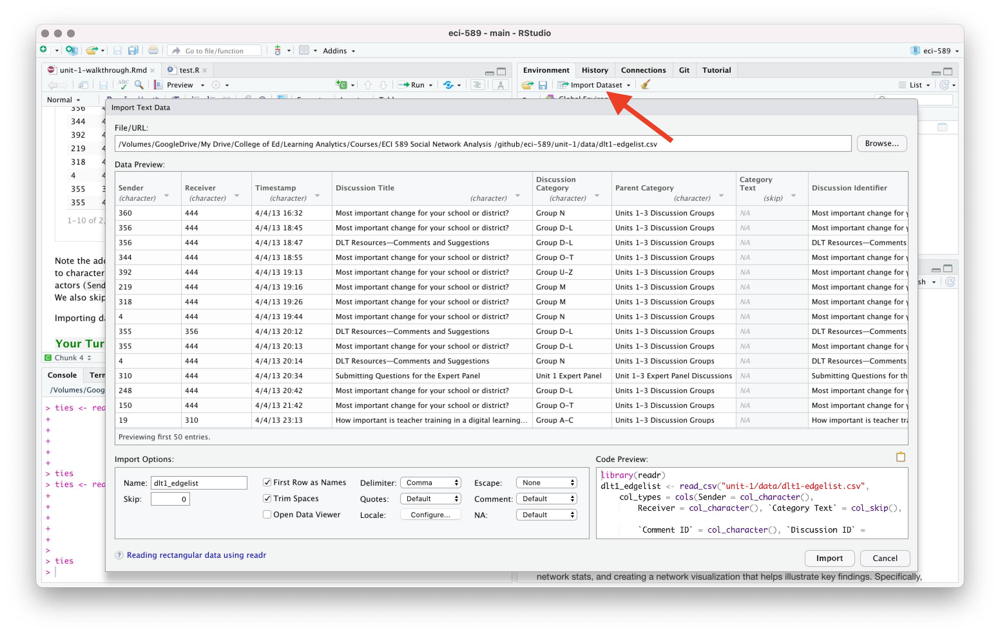

```{r setup, include=FALSE}
knitr::opts_chunk$set(echo = TRUE)
```

# 1. PREPARE

During the second week of each unit, we'll **"walk through"** a basic
research workflow, or data analysis process, modeled after the
Data-Intensive Research Workflow from [Learning Analytics Goes to
School](https://catalog.lib.ncsu.edu/catalog/NCSU4862134) (Krumm et al.,
2018):

{width="80%"}

Each walkthrough will focus on a basic analysis guided by the social
network perspective.

This week, our focus will be on preparing relational data for analysis,
looking at some basic network stats, and creating a network
visualization that helps illustrate key findings. Specifically, the Unit
1 Walkthrough will cover the following workflow topics:

1.  **Prepare**: Prior to analysis, we'll take a look at the context in
    which are data is derived, you're working with so you can formulate
    useful and answerable questions. You'll also need to set up a
    "Project" for our Unit 1 walkthrough.

2.  **Wrangle**: Wrangling data entails the work of manipulating,
    cleaning, transforming, and merging data. In section 2 we focus on
    reading, reducing, and tidying our data.

3.  **Explore**: In section 3, we use simple summary statistics, more
    sophisticated approaches like term frequency-inverse document
    frequency (tf-idf), and basic data visualization to explore our data
    and see what insight it provides in response to our question.

4.  **Model**: While we won't investigate approaches to **Model** our
    data until Unit 3 when we learn about community detection algorithms
    and exponential random graph models (ERGM), we will see how modeling
    has been applied.

5.  **Communicate**:

## 1a. Review the Research

Prior to analysis, it's critical to understand the context and data
sources available so you can formulate useful questions that can be
feasibly addressed by your data. For this section, we'll focus on the
following topics:

In [Social Network Analysis and Education: Theory, Methods &
Applications](https://methods.sagepub.com/book/social-network-analysis-and-education),
Carolyn (2013) notes that:

> the **social network perspective** is one concerned with the structure
> of relations and the implication this structure has on individual or
> group behavior and attitudes

More specifically, Carolyn cites the following four features used by
Freeman (2004) to define the social network perspective:

1.  Social network analysis is **motivated by a relational intuition**
    based on ties connecting social actors.

2.  It is firmly **grounded in systematic empirical data**.

3.  It **makes** **use of graphic imagery** to represent actors and
    their relations with one another.

4.  It **relies** **on** **mathematical and/or computational models** to
    succinctly represent the complexity of social life.

For Unit 1, our walkthrough will be guided by previous research and
evaluation work conducted by the Friday Institute for Educational
Innovation as part of the Massively Open Online Courses for Educators
(MOOC-Ed) initiative.

### A Social Network Perspective in MOOC-Eds

{width="40%"}

Kellogg, S., Booth, S., & Oliver, K. (2014). [A social network
perspective on peer supported learning in MOOCs for
educators](https://github.com/sbkellogg/eci-589/blob/main/unit-1/lit/sna_mooc_irrodl_bjet_articles.pdf). *International
Review of Research in Open and Distributed Learning*, *15*(5), 263-289.

#### Research Context

In the spring of 2013, The Friday Institute launched the MOOC-Ed
Initiative to explore the potential of delivering personalized,
high-quality professional development to educators at scale (Kleiman et
al., 2013). In collaboration with the Alliance for Excellent Education,
the Friday Institute launched this initiative with a 6-week pilot course
called Planning for the Digital Learning Transition in K-12 Schools (DLT
1), which was offered again in September 2013 (DLT 2). This course was
designed to help school and district leaders plan and implement K-12
digital learning initiatives.

Academics, as well as pundits from traditional and new media, have
raised a number of concerns about MOOCs, including the lack of
instructional and social supports. Among the core design principles of
MOOC-Eds are collaboration and peer-supported learning. It is an
assumption of this study that challenges arising form this problem of
scale can be addressed by leveraging these massive numbers to develop
robust online learning communities.

This mixed-methods case study used both SNA and qualitative methods to
better understand peer support in MOOC-Eds through an examination of the
characteristics, mechanisms, and outcomes of peer networks. Findings
from this study demonstrate that even with technology as basic as a
discussion forum, MOOCs can be leveraged to foster these networks and
facilitate peer-supported learning. Although this study was limited to
two unique cases along the wide spectrum of MOOCs, the methods applied
provide other researchers with an approach for better understanding the
dynamic process of peer supported learning in MOOCs.

#### Data Sources

**MOOC-Ed registration form.** All participants completed a registration
form for each MOOC-Ed course. The registration form consists of
self-reported demographic data, including information related to their
professional role and work setting, years of experience in education,
and personal learning goals.

**MOOC-Ed discussion forums.** All peer interaction, including peer
discussion, feedback, and reactions (e.g., likes), take place within the
forum area of MOOC-Eds, which are powered by Vanilla Forums. Because of
the specific focus on peer supported learning, postings to or from
course facilitators and staff were removed from the data set. Finally,
analyses described below exclude more passive forms of interactions
(i.e., read and reaction logs), and include only postings among peers.

For our Unit 1 walkthrough, we'll take a look at data from the original
Digital Learning Transition in K-12 Schools (DLT 1) which was not
included in this study so we can make comparisons in our analysis to the
DLT 2 course reported in this study. Also, for your independent
analysis, you may want to consider working with the DLT 2 data to see if
you can replicate some of the findings from this paper!

#### [**Your Turn**]{style="color: green;"} **⤵**

Take a quick look at the *Description of the Dataset* section from the
[Massively Open Online Course for Educators (MOOC-Ed) network
dataset](https://github.com/sbkellogg/eci-589/blob/main/unit-1/lit/bjet_12312_Rev.pdf)
BJET article, and feel free to download and open the accompanying data
sets stored on [Harvard
Dataverse](https://dataverse.harvard.edu/dataset.xhtml?persistentId=doi:10.7910/DVN/ZZH3UB)
that we'll be using for this walkthrough.

In the space below, type a brief response to the following questions:

1.  What were some of the steps necessary to construct this dataset?

    -   

2.  What two "node attributes" from the dataset that might be useful for
    predicting participants who may be more engaged or central to the
    network? Why did you select those two?

    -   

3.  What else do you notice/wonder about this dataset?

    -   

## 1b. Identify a Question(s)

A Social Network Perspective on Peer Supported Learning in MOOC-Eds was
framed by three primary research questions related to peer supported
learning:

1.  What are the patterns of peer interaction and the structure of peer
    networks that emerge over the course of a MOOC-Ed?

2.  To what extent do participant and network attributes (e.g.,
    homophily, reciprocity, transitivity) account for the structure of
    these networks?

3.  To what extent do these networks result in the co-construction of
    new knowledge?

For our very first walkthrough, we are going to focus exclusively on RQ1
from the original study. Our question of interest is focused on very
basic questions about our educator network:

> How, and to what extent, did educators engage with other participants
> in the discussion forums?

### [**Your Turn**]{style="color: green;"} **⤵**

Based on our course readings and your self-selected readings, what
subquestions, or more specific research questions, might ask that help
you answer the broader question we'll be focused on for this
walkthrough?

In the space below, type a brief response to the following questions:

\-

## 1c. Load Libraries

As highlighted in [Chapter 6 of Data Science in Education Using
R](https://datascienceineducation.com/c06.html#c06p) (DSIEUR):

> Packages are shareable collections of R code that can contain
> functions, data, and/or documentation. Packages increase the
> functionality of R by providing access to additional functions to suit
> a variety of needs.

Let's check to see which packages have already been loaded into our
RStudio Cloud workspace. Take a look at the the Files, Plots, & Packages
Pane in the lower right hand corner of RStudio Cloud to make sure these
packages have been installed and loaded:

{width="90%"}

You should see some familiar tidytext packages from our [Getting Started
Walkthrough](https://sbkellogg.github.io/eci-589/unit-0/unit-0-walkthrough.html)
like {dplyr} and {readr} which we'll be using again shortly. You should
also see an important package call {igraph} that will rely on heavily
for our network analyses.

If you are working in RStudio Desktop, or notice that the packages have
not been installed and/or loaded, run the following `install.packages()`
function code to install the {tidyverse} and {igraph} packages:

```{r, eval=FALSE}
install.packages("tidyverse")
install.packages("igraph") 
```

Let's go ahead and use `library()` function for the {tidyverse} package
just to review the other packages from the [tidyverse collection of
packages](https://www.tidyverse.org) that this package contains:

```{r}
library(tidyverse)
```

### igraph **📦**

{width="30%"}

For our Unit 1 Walkthrough, we will rely heavily on the [igraph network
analysis package](https://igraph.org). The main goals of the igraph
package and the collection of network analysis tools it contains are to
provide a set of data types and functions for:

1.  pain-free implementation of graph algorithms,

2.  fast handling of large graphs, with millions of vertices and edges.

3.  allowing rapid prototyping via high level languages like R.

Run the code chunk below to load the {igraph] library:

```{r}
library(igraph)
```

### [**Your Turn**]{style="color: green;"} **⤵**

Take a look at the messages from the output of after loading the igraph
library. What tidyverse packages share identically named functions with
igraph?

Write your response in the space below.

\-

------------------------------------------------------------------------

# 2. WRANGLE

In general, data wrangling involves some combination of cleaning,
reshaping, transforming, and merging data (Wickham & Grolemund, 2017).
The importance of data wrangling is difficult to overstate, as it
involves the initial steps of going from the raw data to a dataset that
can be explored and modeled (Krumm et al, 2018).

For our data wrangling this week, we're keeping it simple since working
with network data is a bit of a departure from our working with
rectangular data frames. Our primary goals for Unit 1 are learning how
to:

a.  **Import Data**. Before working with data, we need to "read" it into
    R and once imported, we'll take at different ways to view our data
    in R.

b.  **Create a Network Object**.

c.  **Simplify Network**. Finally, we'll learn about a handy
    `simplify()` function in the {igraph} package for removing ties that
    .

## 2a. Import Data

### The Edge-List Format

To get started, we need to import, or "read", our data into R. The
function used to import your data will depend on the file format of the
data you are trying to import, but R is pretty adept at working with
many files types.

Take a look in the `data` folder in your Files pane. You should see the
following .csv files:

-   `dlt1-edgelist.csv`

-   `dlt1-nodes.csv`

As its name implies, the first file `dlt1-edgelist.csv` is an edge-list
that contains information about each tie, or relation between two actors
in a network. In this context, a "tie" is a reply by one participant in
the discussion forum to the post of another participant - or in some
cases to their own post! These ties between a single actor are called
"self-loops" and as we'll see later in this section, igraph has a
special function to remove these self loops from a sociogram, or network
visualization.

The edge-list format is slightly different than other formats you have
likely worked with before in that the values in the first two columns
each row represent a dyad, or tie between two nodes in a network. An
edge-list can also contain other information regarding the strength or
duration of the relationship, sometime called "weight", in addition to
other "edge attributes."

In addition to

-   `Sender` = Unique identifier of author of comment

-   `Receiver` = Unique identifier of identified recipient of comment

-   `Timestamp` = Time comment was posted

-   `Parent` = Primary category or topic of thread

-   `Category` = Subcategory or subtopic of thread

-   `Thread_id` = Unique identifier of a thread

-   `Comment_id` = Unique identifier of a comment\\

Let's use the `read_csv()` function from the {readr} package introduced
in the Getting Started walkthrough to read in our edge-list and print
the new `ties` data frame:

```{r}
ties <- read_csv("data/dlt1-edgelist.csv", 
                 col_types = cols(Sender = col_character(), 
                                  Receiver = col_character(), 
                                  `Category Text` = col_skip(), 
                                  `Comment ID` = col_character(), 
                                  `Discussion ID` = col_character()))

ties
```

Note the addition of the `col_types =` argument for changing the column
types to character strings since the numbers for for those particular
columns indicate actors (`Sender` and `Reciever`) and attributes
(`Comment_ID` and `Discussion_Id`). We also skipped the `Category Text`.

**RStudio Tip:** Importing data and dealing with data types can be a bit
tricky, especially for beginners. Fortunately, RStudio has an "Import
Dataset" feature in the Environment Pane that can help you use the
{readr} package and associated functions to greatly facilitate this
process.



#### [**Your Turn**]{style="color: green;"} **⤵**

Consider the example pictured below of a discussion thread from the
Planning for the Digital Learning Transition in K-12 Schools (DLT 1)
where our data orginated. This thread was initiated by participant I, so
the comments by J and N are considered to be directed at I. The comment
of B, however, is a direct response to the comment by N as signaled by
the use of the quote-feature as well as the explicit mentioning of N's
name within B's comment.


Now answer the following questions as they relate to the DLT 1 edge-list
we just read into R.

1.  Which actors in this thread are the `Sender` and the `Reciever`?
    Which actor is both?

    -   

2.  How many dyads are in this thread? Which pairs of actors are dyads?

    -   

**Sidebar:** Unfortunately, these types of nuances in discussion forum
data as illustrated by this simple example are rarely captured through
automated approaches to constructing networks. Fortunately, the dataset
you are working with was carefully reviewed to try and capture more
accurately the intended recipients of each reply.

### Node Attributes

The second file is we'll be using to help understand out network and the
actors involved contains all the nodes or actors (i.e., participants who
posted to the discussion forum) as well as some of their attributes such
as gender and years of experience in education.

Carolyn (2013) notes that most social network analyses include variables
that describe attributes of actors, ones that are either categorical
(e.g., sex, race, etc.) or continuous in nature (e.g., test scores,
number of times absent, etc.). These attributes that can be incorporated
into a network graph or model to making it much more informative and can
aid in testing or generating hypotheses.

These attribute variables are typically included in a rectangular array,
or dataframe, that mimics the actor-by-attribute that is the dominant
convention in social science, i.e. rows represent cases, columns
represent variables, and cells consist of values on those variables.

As and aside, Carolyn also refers to this historical preference by
researchers for "actor-by-attribute" data, in the absence of relational
data in which the actor has been removed their social context, as the
"sociological meatgrinder" in action. Specifically, this historical
approach assumes that the actor does not interact with anyone else in
the study and that outcomes are solely dependent of the characteristics
of the individual.

Regardless, let's read in our node attribute file and take a look at the
`actors` and their attributes included in our dataset:

```{r}
actors <- read_csv("data/dlt1-nodes.csv", 
                   col_types = cols(UID = col_character(), 
                                    Facilitator = col_character(), 
                                    expert = col_character(), 
                                    connect = col_character()))
```

#### [**Your Turn**]{style="color: green;"} **⤵**

Use the code chunk below and a function of your choosing to take a look
at the `actors` data frame:

```{r}

```

Match up the attributes included in the node file with the following
codebook descriptors. The first one has been done as an example.

-   `Facilitator` = Identification of course facilitator (1 **=**
    instructor)
-   Dummy variable for whether participants listed
    networking/collaboration with others as one of their course goals on
    the registration form
-   Identifier of "expert panelists" invited to course to share
    experience through recorded Q&A
-   Identification of course facilitator (1 **=** instructor)
-   Professional role (eg, teacher, librarian, administrator)
-   Years of experience as an educator
-   Works with elementary, middle, and/or high school students
-   Initial assignment of discussion group

## 2b. Create Network Object

Before we can begin using many of the functions from the {igraph} for
summarizing and visualizing our DLT 1 network, we first need to convert
the data frames that we imported into an igraph network object, or an
igraph graph.

### Convert to an igraph Graph

To do that, we will use the `graph_from_data_frame()` function. Run the
following code to take a look at the help documentation for this
function:

```{r}
?graph_from_data_frame
```

You probably saw that this particular function take the following three
arguments, two of which are data frames:

-   **d** describes the edges of the network. The first two columns are
    the IDs of the source and the target node for each edge, in our case
    the `Sender` and `Reviever` of a discussion post. The order matters!
    The following columns are edge attributes such as weight, type,
    label, or anything else.

-   **vertices** starts with a column of node IDs and any following
    columns are interpreted as node attributes.

-   **directed** is determines whether or not to create a directed
    graph.

Run the following code to specify our `ties` data frame as the edges of
our network, our `actors` data frame for the vertices of our network and
their attributes, and indicate that this is indeed a directed network.

```{r}
network <- graph_from_data_frame(d = ties, 
                                 vertices = actors, 
                                 directed = T) 

network
```

#### [**Your Turn**]{style="color: green;"} **⤵**

Take a look at the very first line of the output which contains some
basic information about our network and answer the following questions:

1.  How many actors and ties are in our network? Is this consistent with
    the number of observations in our data frames?

    -   

2.  The D and the N indicate that this is a **D**irected network and has
    the **N**ame vertex attributes set. Why are the other two blank?

    -   

3.  Which vertex attribute did igraph interpret as numeric?

    -   

### Simplify Graph

### Add Edge Weights

# 3. EXPLORE

# 4. MODEL

As highlighted in [Chapter 3 of Data Science in Education Using
R](https://datascienceineducation.com/c03.html), the **Model** step of
the data science process entails "using statistical models, from simple
to complex, to understand trends and patterns in the data." The authors
note that while descriptive statistics and data visualization during
the **Explore** step can help us to identify patterns and relationships
in our data, statistical models can be used to help us determine if
relationships, patterns and trends are actually meaningful.

We will not explore the use of models for SNA until Unit 3, recall from
the PREPARE section that the Kellogg et al. study was guided by the
following questions:

1.  What are the patterns of peer interaction and the structure of peer
    networks that emerge over the course of a MOOC-Ed?

2.  To what extent do participant and network attributes (e.g.,
    homophily, reciprocity, transitivity) account for the structure of
    these networks?

3.  To what extent do these networks result in the co-construction of
    new knowledge?

To address Question 1, actors in the network were categorized into
distinct mutually exclusive groups using the core-periphery and regular
equivalence functions of UCINET. The former used the CORR algorithm to
divide the network into actors that are part of a densely connected
subgroup, or "core", from those that are part of the sparsely connected
periphery. Regular equivalence employs the REGE blockmodeling algorithm
to partition, or group, actors in the network based on the similarity of
their ties to others with similar ties. In essence, blockmodeling
provides a systematic way for categorizing educators based on the ways
in which they interacted with peers.

As we saw upon just a basic visual inspection of our network during the
Explore section, there was a small core of highly connected participants
surrounded by those on the "periphery," or edge, of the network with
very few connections. In the DLT 2 course, those on the periphery made
up roughly 90% of network. The study also found relatively high levels
of reciprocation, but also found that roughly a quarter of participants
were characterized as "brodcasters" -- educators who initiated a
discussion thread, but neither reciprocated with those who replied, nor
posted to threads initiated by others.

To address Question 2, this study use the exponential family of random
graph models (ERGM; also known as p\* models), which provide a
statistical approach to network modeling that addresses the complex
dependencies within networks. ERGMs predict network ties and determine
the statistical likelihood of a given network structure, based on an
assumed dependency structure, the attributes of the individuals (e.g.,
gender, popularity, location, previous ties) and prior states of the
network.

Finally, in [Learning Analytics Goes to
School](https://catalog.lib.ncsu.edu/catalog/NCSU4862134), the authors
describe modeling as simply developing a mathematical summary of a
dataset and note that there are two general types to modeling:
unsupervised and supervised learning. Clustering algorithms, like REGE
function used to address Q2, are used to explore the structure of a
dataset, while supervised models "help to quantify relationships between
features and a known outcome," similar to the use of actor, relational,
and network attributes to predict tie formation among educators in a
discussion forum using ERGM models.

### [**Your Turn**]{style="color: green;"} **⤵**

Recall from the [1a. Review the Research] that you were asked to
identify two "node attributes" from the dataset that might be useful for
predicting participants who may be more engaged or central to the
network.

Take look at page 276 of the article, [A social network perspective on
peer supported learning in MOOCs for
educators](https://github.com/sbkellogg/eci-589/blob/main/unit-1/lit/sna_mooc_irrodl_bjet_articles.pdf).
Were your predictions correct?

\-

Now that you've become a little familiar with this dataset and the
social network perspective, what other aspects of this dataset, or a
dataset you are interested in exploring, might be modeled to better
understand the structure of this network, and the relationships between
structures or attributes and learning outcomes of interest for those in
network?

Use the space below to write a brief response:

\-

# 5. COMMUNICATE
