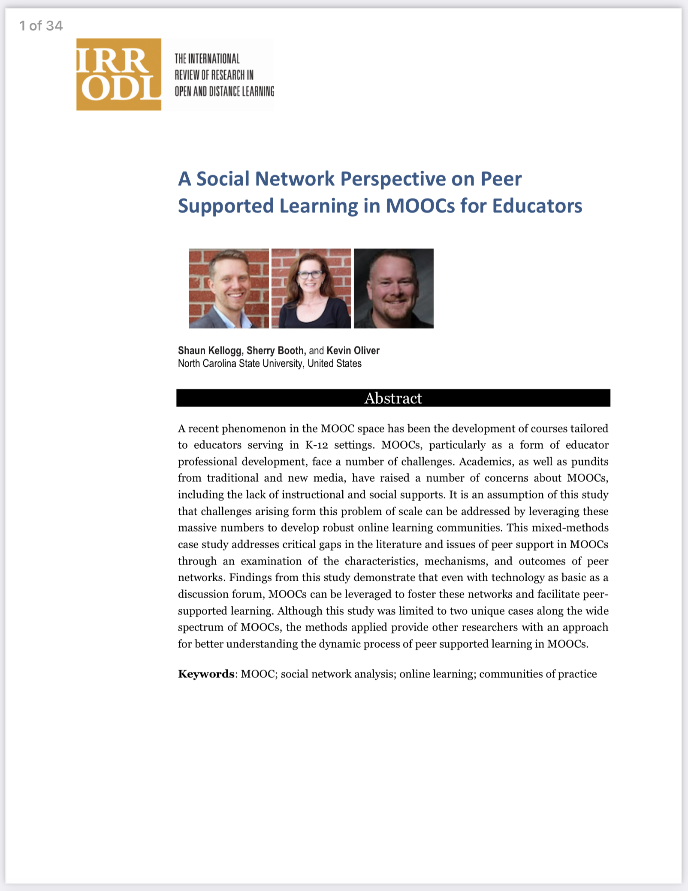

```{r setup, include=FALSE}
knitr::opts_chunk$set(echo = TRUE)
```

# PREPARE

During the second week of each unit, we'll **"walk through"** a basic
research workflow, or data analysis process, modeled after the
Data-Intensive Research Workflow from [Learning Analytics Goes to
School](https://catalog.lib.ncsu.edu/catalog/NCSU4862134) (Krumm et al.,
2018):

{width="80%"}

Each walkthrough will focus on a basic analysis guided by the social
network perspective.

This week, our focus will be on getting familiar with familiar with
preparing relational data for analysis, looking at some basic network
stats, and creating a network visualization that . Specifically, the
Unit 1 Walkthrough will cover the following workflow topics:

1.  **Prepare**: Prior to analysis, it's critical to understand the
    context and data sources you're working with so you can formulate
    useful and answerable questions. You'll also need to set up a
    "Project" for our Unit 1 walkthrough.
2.  **Wrangle**: Wrangling data entails the work of manipulating,
    cleaning, transforming, and merging data. In section 2 we focus on
    reading, reducing, and tidying our data.
3.  **Explore**: In section 3, we use simple summary statistics, more
    sophisticated approaches like term frequency-inverse document
    frequency (tf-idf), and basic data visualization to explore our data
    and see what insight it provides in response to our question.
4.  **Model**: While we won't investigate approaches to **Model** our
    data until Unit 3 when we learn about community detection algorithms
    and exponential random graph models (ERGM), we will see how modeling
    has been applied.
5.  **Communicate**:

## Review the Research

Prior to analysis, it's critical to understand the context and data
sources available so you can formulate useful questions that can be
feasibly addressed by your data. For this section, we'll focus on the
following topics:

In [Social Network Analysis and Education: Theory, Methods &
Applications](https://methods.sagepub.com/book/social-network-analysis-and-education),
Carolyn (2013) notes that:

> the **social network perspective** is one concerned with the structure
> of relations and the implication this structure has on individual or
> group behavior and attitudes

More specifically, Carolyn cites the the following four features used by
Freeman (2004) that define the social network perspective:

1.  Social network analysis is **motivated by a relational intuition**
    based on ties connecting social actors.

2.  It is firmly **grounded in systematic empirical data**.

3.  It **makes** **use of graphic imagery** to represent actors and
    their relations with one another.

4.  It **relies** **on** **mathematical and/or computational models** to
    succinctly represent the complexity of social life.

For Unit 1,

### A Social Network Perspective on Peer Supported Learning in MOOCs for Educators

{width="40%"}

Kellogg, S., Booth, S., & Oliver, K. (2014). A social network
perspective on peer supported learning in MOOCs for
educators. *International Review of Research in Open and Distributed
Learning*, *15*(5), 263-289.

#### Abstract

A recent phenomenon in the MOOC space has been the development of
courses tailored to educators serving in K-12 settings. MOOCs,
particularly as a form of educator professional development, face a
number of challenges. Academics, as well as pundits from traditional and
new media, have raised a number of concerns about MOOCs, including the
lack of instructional and social supports. It is an assumption of this
study that challenges arising form this problem of scale can be
addressed by leveraging these massive numbers to develop robust online
learning communities. This mixed-methods case study addresses critical
gaps in the literature and issues of peer support in MOOCs through an
examination of the characteristics, mechanisms, and outcomes of peer
networks. Findings from this study demonstrate that even with technology
as basic as a discussion forum, MOOCs can be leveraged to foster these
networks and facilitate peer- supported learning. Although this study
was limited to two unique cases along the wide spectrum of MOOCs, the
methods applied provide other researchers with an approach for better
understanding the dynamic process of peer supported learning in MOOCs.

**Data Source & Analysis**

The evaluation used a wide range of data sources including interviews,
document review, site analytics, and surveys, which we'll focus on for
this walkthrough. Survey protocols were designed in cooperation with
NCDPI to systematically collect information about local professional
development, state-level supports, use of available RttT professional
development resources, and organizational and classroom practices in the
schools, which will serve as a baseline to assess changes over the
period of the North Carolina RttT initiatives.

Quantitative analyses focused primarily on descriptive analysis of
item-level responses. In addition, quantitative data from these surveys
were analyzed to examine patterns in responses by participants' role,
event type (e.g., module, webinar, resource), and region. Responses to
open-ended survey items of the Online Resources Survey were manually
coded by their relation to each Learning Forward professional
development standard.

Note that the dataset we'll be using for analysis in this walkthrough is
exported as is from Qualtrics with personal identifiers, select
demographics, metadata, and closed-ended responses removed.

**Summary of Findings**

Approximately half of the state's educators completed at least one
online module by the end of the 2011-12 school year. Overall, most
participants agreed that the webinars and modules were relevant to their
professional development needs, though some content was redundant with
prior PD activities and not always content- or grade-specific, and some
modules did not meet national standards. Most online modules were
completed independently and not in Professional Learning Community
groups.

A common theme from focus groups and open-ended survey responses was the
**convenience** of online professional development. One teacher in a
focus group stated, "I liked the format. And the way that it was given,
it was at your own pace, which works well for our schedules..."
Educators also frequently cited that the **information and resources**
provided through the modules improved their understanding of the new
standards and the teacher evaluation process. Webinar participants
appreciated the useful, updated information presented through a
combination of PowerPoint slides and **video clips**.

While the majority of educators have indicated their satisfaction with
these resources, the findings suggest that the use of these resources at
both the state and local level was not wholly consistent with national
standards for online professional development. Many LEAs likely needed
additional guidance, training, support, technology tools, and/or content
resources to ensure that local efforts contribute to the quality of the
experiences for educators and that the vision for online professional
development outlined in the state's RttT proposal is realized and can be
sustained beyond RttT.

## Refine Questions

The State's progress on designing and implementing online professional
development was originally guided by the following (very) general
evaluation questions:

1.  State Strategies: To what extent did the state implement and support
    proposed RttT professional development efforts?
2.  Short-Term Outcomes: What were direct outcomes of state-level RttT
    professional development efforts?

For this walkthrough, we'll use text mining to complement prior
qualitative analyses conducted as part of the RttT Evaluation by
examining responses to open-ended questions on the RttT Online PD Survey
administered to over 15,000 NC educators.

Our (very) specific questions of interest for this walkthrough are:

1.  What aspects of online professional development offerings do
    *teachers* find most valuable?
2.  How might resources differ in the value they afford teachers?

Finally, one overarching question we'll explore throughout this course,
and that Silge and Robinson (2018) identify as a central question to
text mining and natural language processing, is:

> How do we to **quantify** what a document or collection of documents
> is about?

## Set Up a Project

As highlighted in Chapter 6 of Data Science in Education Using R
(DSIEUR), one of the first steps of every workflow should be to set up a
"Project" within RStudio. This will be your "home" for any files and
code used or created in Unit 1. Open RStudio and follow these steps from
DESIUR 6.6 to create a Project for Unit 1:

1.  Click on "File"
2.  Select "New Project"
3.  Choose "New Directory"
4.  Click on "New Project"
5.  Enter your Project's name in the box that says, "Directory name".
    Choose a Project name that helps you remember that this is a project
    is part of Unit 1: Tidy Text & Word Counts. Avoid using spaces in
    your Project name, and instead, separate words with hyphens or
    underscore characters.
6.  Choose where to save your Project by clicking on "Browse" next to
    the box labeled "Create project as a subdirectory of:". If you are
    just using this to learn and test out creating a Project, consider
    placing it in your downloads or another temporary directory so that
    you remember to remove it later.
7.  Click "Create Project"

{width="40%"}

Now that you have a Project to store .R scripts that you create as you
work through this unit, let's create our first .R script:

1.  Click on "File"
2.  Select "R script"
3.  Click the disk icon or select "Save" from file menu to save.
4.  Enter a file name. See the [R Style
    Guide](https://style.tidyverse.org/files.html#names) for standard
    file naming conventions.

### Install Packages

Finally, using your newly created R script, type the following code to
load the packages we installed last week and that we'll be needing for
this walkthrough.

```{r, eval=FALSE}
install.packages("tidyverse")
install.packages("igraph") 
install.packages("network") 
install.packages("sna")
install.packages("ggraph")
```

### Load Libraries

```{r}
library(tidyverse)
```

At the end of this week, I'll ask that you share with me your r script
as evidence that you have complete the walkthrough. Although I highly
recommend that that you manually type the code shared throughout this
walkthrough, for large blocks of text it may be easier to cut and paste.

------------------------------------------------------------------------

# WRANGLE

\

## Import Data

\

```{r}
library(readr)
```

Screenshot of data import

code example

```{r import-ties}
ties <- read_csv("data/dlt1-edgelist.csv", 
                 col_types = cols(Sender = col_character(), 
                                  Receiver = col_character(), 
                                  `Category Text` = col_skip(), 
                                  `Comment ID` = col_character(), 
                                  `Discussion ID` = col_character()))
```

\
view and explain\

```{r}
 glimpse(ties)
```

```{r import-actors}
library(readr)
actors <- read_csv("data/dlt1-nodes.csv", 
                       col_types = cols(UID = col_character(), 
                                        Facilitator = col_character(), 
                                        expert = col_character(), 
                                        connect = col_character()))
```

\
view and explain

```{r}

```

```{r load-igraph}
library(igraph)
```

\

```{r}
net <- graph_from_data_frame(d=ties, 
                             vertices=actors, 
                             directed=T) 
net
```

## Calculate Edge Weight

```{r}
edges <- ties %>% 
  count(Sender, Receiver) %>%
  rename(weight = n)

edges
```

\

```{r}
net <- graph_from_data_frame(d=edges, 
                             vertices=actors, 
                             directed=T) 
net
```

\
\

```{r}
plot(net)
```

## 3. EXPLORE

```{r}
library(ggraph)
```

```{r}
ggraph(net) +
  geom_edge_link() +   # add edges to the plot
  geom_node_point()    # add nodes to the plot

```

```{r}
ggraph(net, layout = "fr") +
  geom_edge_link() +   # add edges to the plot
  geom_node_point()    # add nodes to the plot
```

### Network Stats

#### density

```{r}

edge_density(net, loops=F)

```

```{r}
ecount(net)/(vcount(net)*(vcount(net)-1)) #for a directed network
```

#### reciprocity

```{r}
reciprocity(net)
```

\

### Community

```{r}
ceb <- cluster_edge_betweenness(net) 

dendPlot(ceb, mode="hclust")

```

\

### Sociograms

\

```{r}

deg <- degree(net, mode="out")

net <- simplify(net, remove.multiple = F, remove.loops = T) 

plot(net, 
     layout = layout_with_kk,
     edge.arrow.size=.01,
     edge.width = .1,
     vertex.label=NA,
     vertex.size=deg*.1)


```

\

\
