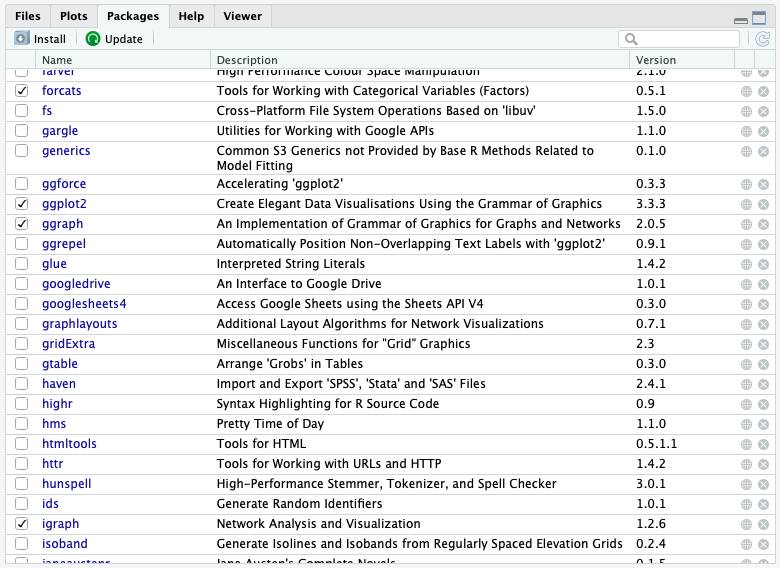
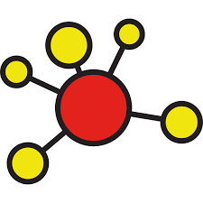

```{r setup, include=FALSE}
knitr::opts_chunk$set(echo = TRUE)
```

# 1. PREPARE

During the second week of each unit, we'll **"walk through"** a basic
research workflow, or data analysis process, modeled after the
Data-Intensive Research Workflow from [Learning Analytics Goes to
School](https://catalog.lib.ncsu.edu/catalog/NCSU4862134) (Krumm et al.,
2018):

{width="80%"}

Each walkthrough will focus on a basic analysis guided by the social
network perspective.

This week, our focus will be on preparing relational data for analysis,
looking at some basic network stats, and creating a network
visualization that helps illustrate key findings. Specifically, the Unit
1 Walkthrough will cover the following workflow topics:

1.  **Prepare**: Prior to analysis, we'll take a look at the context in
    which are data is derived, you're working with so you can formulate
    useful and answerable questions. You'll also need to set up a
    "Project" for our Unit 1 walkthrough.

2.  **Wrangle**: Wrangling data entails the work of manipulating,
    cleaning, transforming, and merging data. In section 2 we focus on
    reading, reducing, and tidying our data.

3.  **Explore**: In section 3, we use simple summary statistics, more
    sophisticated approaches like term frequency-inverse document
    frequency (tf-idf), and basic data visualization to explore our data
    and see what insight it provides in response to our question.

4.  **Model**: While we won't investigate approaches to **Model** our
    data until Unit 3 when we learn about community detection algorithms
    and exponential random graph models (ERGM), we will see how modeling
    has been applied.

5.  **Communicate**:

## 1a. Review the Research

Prior to analysis, it's critical to understand the context and data
sources available so you can formulate useful questions that can be
feasibly addressed by your data. For this section, we'll focus on the
following topics:

In [Social Network Analysis and Education: Theory, Methods &
Applications](https://methods.sagepub.com/book/social-network-analysis-and-education),
Carolyn (2013) notes that:

> the **social network perspective** is one concerned with the structure
> of relations and the implication this structure has on individual or
> group behavior and attitudes

More specifically, Carolyn cites the following four features used by
Freeman (2004) to define the social network perspective:

1.  Social network analysis is **motivated by a relational intuition**
    based on ties connecting social actors.

2.  It is firmly **grounded in systematic empirical data**.

3.  It **makes** **use of graphic imagery** to represent actors and
    their relations with one another.

4.  It **relies** **on** **mathematical and/or computational models** to
    succinctly represent the complexity of social life.

For Unit 1, our walkthrough will be guided by previous research and
evaluation work conducted by the Friday Institute for Educational
Innovation as part of the Massively Open Online Courses for Educators
(MOOC-Ed) initiative.

### A Social Network Perspective in MOOC-Eds

{width="40%"}

Kellogg, S., Booth, S., & Oliver, K. (2014). [A social network
perspective on peer supported learning in MOOCs for
educators](https://github.com/sbkellogg/eci-589/blob/main/unit-1/lit/sna_mooc_irrodl_bjet_articles.pdf). *International
Review of Research in Open and Distributed Learning*, *15*(5), 263-289.

#### Research Context

In the spring of 2013, The Friday Institute launched the MOOC-Ed
Initiative to explore the potential of delivering personalized,
high-quality professional development to educators at scale (Kleiman et
al., 2013). In collaboration with the Alliance for Excellent Education,
the Friday Institute launched this initiative with a 6-week pilot course
called Planning for the Digital Learning Transition in K-12 Schools (DLT
1), which was offered again in September 2013 (DLT 2). This course was
designed to help school and district leaders plan and implement K-12
digital learning initiatives.

Academics, as well as pundits from traditional and new media, have
raised a number of concerns about MOOCs, including the lack of
instructional and social supports. Among the core design principles of
MOOC-Eds are collaboration and peer-supported learning. It is an
assumption of this study that challenges arising form this problem of
scale can be addressed by leveraging these massive numbers to develop
robust online learning communities.

This mixed-methods case study used both SNA and qualitative methods to
better understand peer support in MOOC-Eds through an examination of the
characteristics, mechanisms, and outcomes of peer networks. Findings
from this study demonstrate that even with technology as basic as a
discussion forum, MOOCs can be leveraged to foster these networks and
facilitate peer-supported learning. Although this study was limited to
two unique cases along the wide spectrum of MOOCs, the methods applied
provide other researchers with an approach for better understanding the
dynamic process of peer supported learning in MOOCs.

#### Data Sources

**MOOC-Ed registration form.** All participants completed a registration
form for each MOOC-Ed course. The registration form consists of
self-reported demographic data, including information related to their
professional role and work setting, years of experience in education,
and personal learning goals.

**MOOC-Ed discussion forums.** All peer interaction, including peer
discussion, feedback, and reactions (e.g., likes), take place within the
forum area of MOOC-Eds, which are powered by Vanilla Forums. Because of
the specific focus on peer supported learning, postings to or from
course facilitators and staff were removed from the data set. Finally,
analyses described below exclude more passive forms of interactions
(i.e., read and reaction logs), and include only postings among peers.

For our Unit 1 walkthrough, we'll take a look at data from the original
Digital Learning Transition in K-12 Schools (DLT 1) which was not
included in this study so we can make comparisons in our analysis to the
DLT 2 course reported in the study.

#### [**Your Turn**]{style="color: green;"} **⤵**

Take a quick look at the Description of the Dataset section from the
[Massively Open Online Course for Educators (MOOC-Ed) network
dataset](https://github.com/sbkellogg/eci-589/blob/main/unit-1/lit/bjet_12312_Rev.pdf),
as well as the accompanying data sets that we'll be using for this
walkthrough stored on [Harvard
Dataverse](https://dataverse.harvard.edu/dataset.xhtml?persistentId=doi:10.7910/DVN/ZZH3UB).

In the space below, type a brief response to the following questions:

1.  How was this dataset constructed?

    -   

2.  Name two "node attributes" from the dataset that might be useful for
    predicting participants who may be more engaged or central to the
    network? Why did you select those two?

    -   

## 1b. Identify Research Questions

A Social Network Perspective on Peer Supported Learning in MOOC-Eds was
framed by three primary research questions related to peer supported
learning:

1.  What are the patterns of peer interaction and the structure of peer
    networks that emerge over the course of a MOOC-Ed?

2.  To what extent do participant and network attributes (e.g.,
    homophily, reciprocity, transitivity) account for the structure of
    these networks?

3.  To what extent do these networks result in the co-construction of
    new knowledge?

For our very first walkthrough, we are going to focus exclusively on RQ1
from the original study. Our question of interest is focused on very
basic questions about our educator network:

> How, and to what extent, did educators engage with other participants
> in the discussion forums?

#### [**Your Turn**]{style="color: green;"} **⤵**

Based on our course readings and your self-selected readings, what
subquestions, or more specific research questions, might ask that help
you answer the broader question we'll be focused on for this
walkthrough?

In the space below, type a brief response to the following questions:

\-

## 1c. Check Packages

As highlighted in [Chapter 6 of Data Science in Education Using
R](https://datascienceineducation.com/c06.html#c06p) (DSIEUR):

> Packages are shareable collections of R code that can contain
> functions, data, and/or documentation. Packages increase the
> functionality of R by providing access to additional functions to suit
> a variety of needs.

Let's check to see which packages have already been loaded into our
RStudio Cloud workspace. Take a look at the the Files, Plots, & Packages
Pane in the lower right hand corner of RStudio Cloud to make sure these
packages have been installed and loaded:

{width="90%"}

You should see some familiar tidytext packages from our [Getting Started
Walkthrough](https://sbkellogg.github.io/eci-589/unit-0/unit-0-walkthrough.html)
like {dplyr} and {readr} which we'll be using again shortly. You should
also see an important package call {igraph} that will rely on heavily
for our network analyses.

If you are working in RStudio Desktop, or notice that the packages have
not been installed and/or loaded, run the following code:

```{r, eval=FALSE}
install.packages("tidyverse")
install.packages("igraph") 

library(tidyverse)
library(igraph)
```

### igraph **📦**

{width="30%"}

At the end of this week, I'll ask that you share with me your r script
as evidence that you have complete the walkthrough. Although I highly
recommend that that you manually type the code shared throughout this
walkthrough, for large blocks of text it may be easier to cut and paste.

------------------------------------------------------------------------

# 2. WRANGLE

In general, data wrangling involves some combination of cleaning,
reshaping, transforming, and merging data (Wickham & Grolemund, 2017).
The importance of data wrangling is difficult to overstate, as it
involves the initial steps of going from the raw data to a dataset that
can be explored and modeled (Krumm et al, 2018).

For our data wrangling this week, we'll keep it simple. Our primary
goals for Unit 1 are to learning how to:

a.  **Import Data**. Before working with data, we need to "read" it into
    R and once imported, we'll take at different ways to view our data
    in R.

b.  **Create a Network Object**.

c.  **Simplify Network**. Finally, we'll learn about a handy
    `simplify()` function in the {igraph} package for removing ties that
    .\

## Import Data
