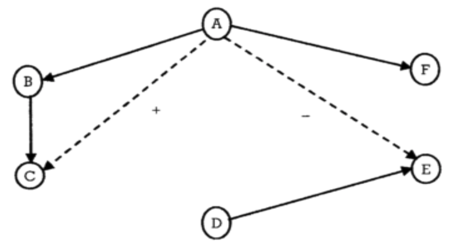

```{r setup, include=FALSE}
knitr::opts_chunk$set(echo = TRUE)
```

## 1. Prepare

Our Unit 2 Case Study: Collaboration revisits some of excellent research
by Dr. Alan Daly and centers around the impact No Child Left Behind
reform efforts on school and district leadership networks. In this unit
we move beyond visual depictions of networks using sociograms from our
previous SNA case study and learn to describe networks using a wide
range

> **Mathematical approaches** focus on what a network of actors "looks
> like" by describing the network using sociograms and/or network
> measures such as reciprocity, centrality, and density.

In addition to investigating tweets around the these controversial state
standards, our Unit 2 Walkthrough will cover the following topics
pertaining to each data-intensive workflow process:

1.  **Prepare**: Prior to analysis, we'll take a look at the context
    from which our data came, formulate some research questions, and get
    introduced the {rtweet} R package for using the Twitter API.

2.  **Wrangle**: Wrangling data entails the work of manipulating,
    cleaning, transforming, and merging data. In section 2 we will learn
    about the {tidygraph} package for creating network objects.

3.  **Explore**: In section 3, we use the {tidygraph} package and the
    companion {ggraph} package to calculate a range of centrality
    measures and learn how to illustrate some of these stats through
    network visualization.

4.  **Model**: We wrap up our analysis in Section 4 by introducing
    community detection and sentiment analysis algorithms for
    identifying groups and gauging sentiment about the common core.

5.  **Communicate**: We briefly reflect on our walkthrough in
    preparation for our independent analysis next week.

### 1a. Review the Research

In [Social Network Analysis and Education: Theory, Methods &
Applications](https://methods.sagepub.com/book/social-network-analysis-and-education)
@carolan2014 makes the following distinctions between mathematical and
statistical approaches to social network analysis:

Specifically, we will try to replicate the P\* models used in Chapter 9
of @carolan2014 in order to test hypotheses about individual and network
characteristics that may explain who school leaders select for
collaboration and confidential exchanges.

#### Research Questions

For this walkthrough, we will be using school leadership data were
collected at two school districts over 3 consecutive years that was used
to answer the following research questions:

1.  Is there a relationship between the frequency of collaboration
    between school leaders and how often they turn to each other to
    discuss issues of a confidential nature?
2.  Do school leaders prefer to collaborate with those with whom they
    have collaborated in the past, or is there some other reason?
3.  Does gender or some other individual attribute predicts confidential
    exchanges between school leaders, or does some previous relation
    have a stronger effect?
4.  Does collaboration between leaders explain one's level of trust in
    one's administrative colleagues?
5.  Can we distinguish among different groups of school leaders based on
    how frequently they collaborate, and if so, are these groupings
    related to the level at which they work (school versus district)?

#### Data Collection

For each consecutive year, school district leaders were invited to
complete a survey that collected individual:

-   **Demographic information** (e.g., gender, ethnicity, marital
    status, age, years of experiences);

-   **Network relationships types** (e.g., collaboration, confidential
    exchanges, energy, expertise, leaders approached for support,
    work-related issues, input, recognition, best practices, and
    innovation);

-   **Frequency of interactions** they have with those nominated
    individuals on a four-point frequency scale ranging from 1 (the
    least frequent) to 4 (1--2 times a week);

-   **Leadership efficacy** items were designed based on the Principal
    Efficacy Scale used in Daly et al. (2011) and Tschannen-Moran and
    Gareis's (2004) studies. The efficacy scale includes 18 items rated
    on a 9-point Likert scale ranging from 1 (None at all) to 9 (A great
    deal);

-   **Trust** scale contains eight items rated on a 7-point Likert scale
    ranging from 1 (Strongly disagree) to 7 (Strongly agree) modified
    from Tschannen-Moran and Hoy (2003).

#### Analyses

#### Key Findings

In response to research questions 1 & 2 from above, Carolyn reported
that "while collaboration in year 1 does not significantly predict
collaboration in year 3, confidential exchanges in year 1 does" and
suggested that "collaboration among school leaders provides an important
foundation for more sensitive, perhaps even deeper, relations (e.g.,
confidential exchanges) at a later point in time."

### 

For our Unit 3 Walkthrough, we focus specifically on generative
processes, or micro-level mechanisms, the might help explain who school
leaders select to collaborate with or engage in confidential exchanges.
Review Chapter 9 of SNA and Education and report out on the findings
from the ERGM analysis in response to Research Question 3 below:

3.  **Does gender or some other individual attribute predicts
    confidential exchanges between school leaders, or does some previous
    relation have a stronger effect?**

    -   YOUR RESPONSE HERE

Based on what you know about networks and the context so far, what other
specific question(s) might the data and analyses described allow you to
address. For example, the concept of homophily, or the tendency for
people to seek out or form ties to those who are similar to themselves,
was introduced in our readings and hypotheses about homophily can easily
be tested using using ERGMs:

-   YOUR RESPONSE HERE

Save this question for later as you'll have a chance to empirically test
it by the end of this walkthrough.

In Unit 1, we also learned about **packages**, or libraries, which are
shareable collections of R code that can contain functions, data, and/or
documentation and extend the functionality of R. You can always check to
see which packages have already been installed and loaded into RStudio
Cloud by looking at the the Files, Plots, & Packages Pane in the lower
right hand corner.

### **👉 Your Turn** **⤵**

### 1b. Load Libraries

Recall that R [**packages**](https://en.wikipedia.org/wiki/R_package),
sometimes referred to as libraries, are shareable collections of R code
that can contain functions, data, and/or documentation and extend the
functionality of R. Before loading an R package, you must first make
sure it has been installed in your environment. You can always check to
see which packages have already been installed and loaded into RStudio
Cloud by looking at the the Files, Plots, & Packages Pane in the lower
right hand corner.

Let's go ahead and load the [tidyverse](https://www.tidyverse.org/),
[igraph](https://igraph.org/),
[tidygraph](https://www.data-imaginist.com/2017/introducing-tidygraph/),
and [ggraph](https://ggraph.data-imaginist.com/index.html) packages from
our previous SNA unit since we'll be using them again in this case
study:

Load Packages

```{r libraries}
library(readxl)
library(tidyverse)
library(igraph)
library(tidygraph)
library(ggraph)
```

Next, we will introduce a few new packages that will help us with our
social network analyses.

#### tidygraph 📦

{width="20%"}

The {[tidygraph](https://tidygraph.data-imaginist.com/)} package is a
huge package that exports 280 different functions and methods, including
access to almost all of the `dplyr` verbs plus a few more, developed for
use with relational data. While network data itself is not tidy, it can
be envisioned as two tidy tables, one for node data and one for edge
data. The {tidygraph} package provides a way to switch between the two
tables and uses `dplyr` verbs to manipulate them. Furthermore it
provides access to a lot of graph algorithms with return values that
facilitate their use in a tidy workflow.

Let's go ahead and load the {tidygraph} library:

#### ggraph 📦

{width="20%"}

Created by the same developer as {tidygraph},
{[ggraph](https://ggraph.data-imaginist.com/index.html)} -- pronounced
gg-raph or g-giraffe hence the logo -- is an extension of
{[ggplot](https://ggplot2.tidyverse.org/)} aimed at supporting
relational data structures such as networks, graphs, and trees. Both
packages are more modern and widely adopted approaches data
visualization in R.

While ggraph builds upon the foundation of ggplot and its API, it comes
with its own self-contained set of geoms, facets, etc., as well as
adding the concept of *layouts* to the [grammar of
graphics](https://ggplot2-book.org/introduction.html?q=grammar#what-is-the-grammar-of-graphics),
i.e. the "gg" in ggplot and ggraph.

Let's go ahead and load the {ggraph} library:

```{r}

```

#### igraph 📦

{width="20%"}

Both {tidygraph} and {ggraph} depend heavily [igraph network analysis
package](https://igraph.org/). The main goals of the igraph package and
the collection of network analysis tools it contains are to provide a
set of data types and functions for:

1.  pain-free implementation of graph algorithms,

2.  fast handling of large graphs, with millions of vertices (i.e.,
    actors or nodes) and edges,

3.  allowing rapid prototyping via high level languages like R.

#### readxl 📦

{width="20%"}

The [{readxl}](https://readxl.tidyverse.org/) package makes it easy to
get data out of Excel and into R. Compared to many of the existing
packages (e.g. gdata, xlsx, xlsReadWrite) readxl has no external
dependencies, so it's easy to install and use on all operating systems.
It is designed to work with *tabular* data.

Since one of our data wrangling steps in the next section is importing
network matrices stored in excel files, the package will come in handy.

### 👉 Your Turn ⤵

Use the code chunk below to load the

```{r}

```

Section 1a. Questions:

1.  

## 2. Wrangle

You can also embed plots, for example:

### 2a. Import Data

One of our primary goals for this case study is to examine how
collaboration networks among school and district leaders changed over
time. To do so, we'll need to import two Excel files from the [Social
Network Analysis and Education companion
site](https://studysites.sagepub.com/carolan/study/resources.htm). Both
files contain edges stored as a square matrix (more on this later) for
the first and third year of a study examining the impact of national
reform efforts [@daly2010bridge].

These files are included in the data folder of your R Studio project. A
description of each file from the companion website is linked above and
each data file is linked below:

1.  [**School Leaders Data Chapter
    9_a.**](https://studysites-sagepub-com.prox.lib.ncsu.edu/carolan/study/materials/datasets/99472_ds7.xls) This
    adjacency matrix reports on "collaboration" ties among 43 school
    leaders in year 1 of a three-year study. This is a directed valued
    (weighted) network measured on five-point scale ranging from 0 to 4,
    with higher values indicating more frequent collaborations (1--2
    times/week). These data are used throughout Chapter 9.

2.  [**School Leaders Data Chapter
    9_b.**](https://studysites-sagepub-com.prox.lib.ncsu.edu/carolan/study/materials/datasets/99472_ds8.xlsx) This
    adjacency matrix reports on "collaboration" ties among 43 school
    leaders in year 3 of a three-year study. This is a directed valued
    (weighted) network measured on five-point scale ranging from 0 to 4,
    with higher values indicating more frequent collaborations (1--2
    times/week). 

Recall from above that our relations, or edges, are stored as a valued
[adjacency matrix](https://en.wikipedia.org/wiki/Adjacency_matrix) in
which columns and rows consist of the same actors and each cell contains
information about the tie between each pair of actors. In our case, the
tie is a directed and valued "arc" where the value indicates the
strength of the relationship.

Let's use the `read_excel()` function to import the
`School Leaders Data Chapter 9_d.xlsx` file, add an argument setting the
column names to `FALSE` since our file is a simple matrix with no header
or column names, and assign the matrix to a variable named
`year_1_collaboration`:

**R Studio Tip:** Type `?read_excel` into the console and check the
arguments section to examine the different arguments that can be used
with this function.

```{r import year }

year_1_collaboration <- read_excel("data/year_1_collaboration.xlsx", 
                            col_names = FALSE)
```

Before importing our Year 3 file, let's quickly inspect the R object we
just imported to see what we'll be working with.

```{r year_1_view}

year_1_collaboration

```

As you can see, we have a 43 x 43
"[tibble](https://tibble.tidyverse.org)" or data table representing our
collaboration ties. In Section 2, we'll learn how to restructure this
data into a formal matrix and then convert to a network class R object
so we can explore our data through network visualization and analyses.

### 👉 Your Turn ⤵

Use the code chunk below to import the Year 3 collaboration network
located in data folder of your R project and then inspect your newly
created object to make sure it imported as expected.

```{r year_3_import}
#YOUR CODE HERE

year_3_collaboration <- read_excel("data/year_3_collaboration.xlsx", 
                                   col_names = FALSE)

year_3_collaboration

```

### 2b. Create a Tidy Graph

As noted above, before we can begin exploring our data through through
network visualization and analysis, we must first restructure our data
into a formal matrix and then convert to a network class R object
required by the igraph, tidygraph, and ggraph packages.

However, one thing you may have noticed from our inspection of the data
above is that our data table was missing the names of the school leaders
in our network. Since our original file was missing names, we will need
to supply them. R has packages for creating random names to help
anonymize data, but to keep things simple, we'll just assign the numbers
1-43 as names for our rows and columns.

```{r assign_names}

rownames(year_1_collaboration) <- 1:43

colnames(year_1_collaboration) <- 1:43

```

Again, let quickly inspect our `year_1_collaboration` data table to see
if this worked:

```{r}
year_1_collaboration
```

As you can see, we now have names for our rows and columns corresponding
to each school leader in our network. So we can see that leader 1
collaborated with leader 3 and with a frequency of "3" but obviously did
not collaborate with 2 as indicated by the "0" in the corresponding
cell. Note that leader 3 also indicated that they collaborated with 1,
but on a slightly more frequent basis as indicated by the "4" in the
corresponding cell.

#### Convert to Matrix 

Now that we have names included for our rows and columns, we need to
convert our data table, or tibble, to a formal matrix class object. To
do so is relatively simple using the `as.matrix()` function built into
R.

```{r as_matrix}

year_1_matrix <- as.matrix(year_1_collaboration )

```

The word "class" and "object" have been use quite a bit in this
case-study and warrant a brief explanation. Classes and objects are
basic concepts of Object-Oriented Programming. An **object** is simply a
data structure that has some methods and attributes. Everything in R is
essentially an object. A **class** is just a blueprint or a sketch of
these objects. It represents the set of properties or methods that are
common to all objects of one type.

Let's use the `class()` function on the `year_1_collaboration` and
`year_1_matrix` to see the types of objects we just created:

```{r object_class}

class(year_1_collaboration)

class(year_1_matrix)

```

Great! We can now see that our `year_1_matrix` is formally a object of
the "matrix" class.

#### Convert to 

Our final step before we're able to begin exploring our data is to
convert our matrix to a network object recognized by the {igraph} and
{tidygraph} packages.
The [`as_tbl_graph()`](https://tidygraph.data-imaginist.com/reference/tbl_graph.html) function
can easily convert relational data from all common network data formats
such as matrices,
`network`, `phylo`, `dendrogram`, `data.tree`, `graph`, etc. 

Run the following code to convert our matrix to directed network graph
and save as a new object called `year_1_network`:

```{r}

year_1_network <- as_tbl_graph(year_1_matrix, directed = TRUE)

```

Again, let's inspect the

```{r year_1_network}

year_1_network

```

As you can see, our `year_1_network` provides a range of information
about out network including network size, type, number of components,
and a preview of node and edge lists that it created and can now be used
to create new network variables like degree, reciprocity, and centrality
measures.

### 👉 Your Turn ⤵

Use the code chunk below to complete the following data wrangling steps
for our Year 3 collaboration network from the Excel file you imported
earlier:

1.  Add row and column names to the data frame;

2.  Convert the resulting data frame to a matrix class object and check
    to confirm that it is indeed a matrix;

3.  Convert the matrix to a network class object with directed edges;

4.  Inspect the Year 3 collaboration network and answer the questions
    after the code chunk.

```{r}
#YOUR CODE HERE

rownames(year_3_collaboration) <- 1:43

colnames(year_3_collaboration) <- 1:43

year_3_matrix <- as.matrix(year_3_collaboration)
  
class(year_3_matrix)

year_3_network <- as_tbl_graph(year_3_matrix, directed = TRUE)

year_3_network


```

Section 2 Questions:

1.  What is the size of the Year 3 collaboration network?

    -   

2.  How many components are in this network?

    -   

3.  How many nodes and edges variables are in our tidy graph and what
    does each variable (e.g., weight) represent?

    -   

4.  How does collaboration in Year 3 compare to Year 1 and what
    inferences might you already be able to make just based on the size
    of the two networks?

    -   

## 3. Explore

Relevant to our case study of school leader collaboration, Carolyn notes
in SNA and Education @carolan2014 that:

> ... to address questions that probe a network's dynamics (i.e., its
> change over time), it is necessary to first figure out what the
> network looks like at one point in time, what is commonly referred to
> as the network's topography.

In order to describe a network's **topography**, social network
researchers utilize an array of algorithms and indices to describe both
visually and numerically different characteristics of social networks.
These algorithms and indices rely on both simple and somewhat
sophisticated mathematical computation.

In this section we revisit the {tidygraph} and {ggraph} packages for
creating sociograms and computing basic node and edge-level measures and
introduce some key functions from the {igraph} package for obtaining
complete network-level measures.

### 3a. Visually Describe the Network

One of the defining characteristics of the social network perspective is
its use of graphic imagery to represent actors and their relations with
one another. To emphasize this point, Carolyn (2013) reported that:

> The visualization of social networks has been a core practice since
> its foundation more than 90 years ago and remains a hallmark of
> contemporary social network analysis. 

Network visualization can be used for a variety of purposes, ranging
from highlighting key actors to even serving as works of art. Katya
Ognyanova's also excellent tutorial on [Static and Dynamic Network
Visualization with R](https://kateto.net/network-visualization/) helps
illustrate the variety of goals a good network visualization can
accomplish.

Recall from our previous SNA case study examining Twitter networks
surrounding the Common Core State Standards that we introduced the dead
simple
[`plot()`](https://www.rdocumentation.org/packages/graphics/versions/3.6.2/topics/plot)
function built into R to quickly generate a sociogram showing the nodes
and edges in our network.

Let's supply our `year-1-network` object as the first argument of this
function and see what it produces:

```{r plot}

plot(year_1_network)

```

While not the most aesthetically pleasing plot, it definitely is
functional. As indicated by our tidy graph output from section 1, we can
see that there is one large network component and two additional
components consisting of isolated school leaders with no collaboration
ties.

If this had been a larger network with more nodes and edges, however,
the utility of the basic `plot()` function would evaporate quickly. For
example, try this function out with the Year 3 network in the console
and see what it produces.

Fortunately, the {ggraph} package includes a plethora of plotting
parameters for graph layouts, edges and nodes to improve the visual
design and readability of network graphs.

### **Sociograms with ggraph**

One thing to keep in mind when building a network viz with the {ggraph}
package is that just like it's {ggplot} counterpart for making more
traditional charts and graphs, there is a minimal code template for
producing a basic plot. Specifically, ggraph requires 3 main functions

-   [`ggraph()`](https://ggraph.data-imaginist.com/articles/Layouts.html)
    takes care of setting up the plot object along with creating the
    layout of the graph (default = "stress").

-   [`geom_node_*()`](https://ggraph.data-imaginist.com/articles/Layouts.html)
    functions and their associated arguments add and modify the nodes of
    the network plot.

-   [`geom_edge_*()`](https://ggraph.data-imaginist.com/articles/Edges.html)
    functions and their associated arguments add and modify the edgez of
    the network plot.

Like the basic plotting function above, ggraph has a similar
`autograph()` function for automatically generating a simple sociogram
to get a quick snapshot of your network. Run the following code
supplying our `year_1_network` object as the first argument for this
function: \

```{r autograph}

autograph(year_1_network)

```

As you can see, this produces a very basic plot that includes our
network nodes and edges with minimal styling.

WIthing this function, however, are the three core functions noted above
that can be modified though different arguments or by adding additional
layers of functions to change the visual aesthetics of your sociogram to
highlight key characteristics of the network, like edge weight or
central actors.

Let generate the same basic plot above but explicitly call our ggraph,
node, and edge functions:

```{r}

ggraph(year_1_network) +
  geom_node_point() +
  geom_edge_link()

```

We won't spend a lot of time on styling our graph here. We will save
that effort for when we're ready to communicate our findings to a
specific audience, but lets make some quick functional and aesthetic
changes: Run the following code to:

-   Change the graph layout to the Fruchterman-Reingold (FR) layout
    using the `layout = "fr"` argument to help highlight areas of
    clustering;

-   Change the size of our nodes using the `size = 3` argument to make
    them more visible;

-   Add color to our edges based using the `aes(colour = weight)`
    argument to highlight more frequent collaborations; and,

-   Add the `theme_graph()` layer to remove the gray background.

```{r}

ggraph(year_1_network, layout = "fr") +
  geom_node_point(size = 3) +
  geom_edge_link(aes(colour = weight)) +
  theme_graph()
  

```

That is perhaps slightly better, but before sharing with an education
partner, I would likely do quite a bit more clean up to highlight key
findings specific to network measures that we'll explore in the next
section. For example, I might change the size of nodes for school
leaders based on measures of centralization to highlight more central
actors in the network and add arrows to indicate directionality of the
ties since this is a directed network.

### 👉 Your Turn ⤵

Use the code chunk below created a simple sociogram for the Year 3
collaboration network and answer the questions that follow:

```{r year_3_sociogram}
#YOUR CODE HERE

ggraph(year_3_network, layout = "fr") +
  geom_node_point(size = 3) +
  geom_edge_link(aes(colour = weight)) +
  theme_graph()

```

1.  How does the Year 3 collaboration network compare to Year 1? What
    are some similarities and differences?

    -   

2.  How might you modify this graph to make it more insightful and
    useful? For ideas check out these nework viz tutorials
    [here](http://mr.schochastics.net/netVizR.html),
    [here](https://kateto.net/network-visualization) and
    [here](https://rpubs.com/neloe/ggraph_intro).

    -   

### 3b. Describe the Network Mathematically

This section include some of the most common measures used to describe
the features of complete networks, as well was .

> Network-level structural measures are those that are calculated from
> the entire network. Therefore, they provide an excellent snapshot of
> the network's structure---the pattern of relations among the network's
> actors.

In addition to providing an overall summary of the network, these
measures provide a concrete means to compare relations such as whether
the friendship, social support, and advice seeking networks within the
same fraternity, for example, are comparable. In our case study, for
example, were are

#### 1. Network Size

One simple but important property of a social network is its size, or
the number of nodes and edges in a network. As Carolan notes:

> Size plays an important role in determining what happens in the
> network--- what resources are exchanged among actors, for example...
> Size affects other network measures, but on a conceptual level, it
> influences the structure of relations, as actors only have so many
> resources and capacities for creating and maintaining ties with
> others.

As we saw in the previous section, the `year_1_network` output provided
us with basic information about our networks size, including the number
of nodes and edges in our network. The {igraph} package also has some
basic functions for retrieving the number of nodes and edges in a
network.

Run the following code chunk to use the
[`gorder()`](https://igraph.org/r/html/latest/gorder.html) and
[`gsize()`](https://igraph.org/r/html/latest/gsize.html) functions
obtain the number of vertices and edges respectively:

```{r size}

gorder(year_1_network)

gsize(year_1_network)

```

#### 2. Centralization

A key structural property of complete networks, and often the focus of
network studies is the concept of centralization, or the extent to which
relations are focused on one or a small set of actors. Centralization is
an important concept in network because, as Carolan notes:

> These central actors likely wield a disproportionate amount of
> influence on the network. Therefore, high centralization provides
> fewer actors with more power and control.

Centralization can be based on a number of different measures, but
degree is one of the most common. Degree refers to the number of ties an
actor either sends (out-degree), receives (in-degree), or in the case of
a non-directed network or both sent and received in a directed network,
simply just "degree" for all actors to which one is connected.

The
[`centr_degree()`](https://igraph.org/r/html/latest/centr_degree.html)
function in {igraph} provides a centralization score based on the metric
selected, as well as the degree for each actors in the network. Let's
first take a look at the centralization measure based on number of
actors individuals have ties with regardless of directionality:

```{r}
centr_degree(year_1_network, mode = "all")
```

The first variable `$res` provides node-level centrality scores. So for
example, the first school leader in our network is connected to 5 other
actors in the network. The `$centralization` variable provides our
actual centrality score, which is quite small suggesting a very
decentralized network. And the final `$theoretical_max` provides the
maximum theoretical graph level centralization score for our graph based
on the number of vertices.

Let's also take a quick look at centralization scores for in-degree and
out-degree:

```{r}
centr_degree(year_1_network, mode = "out")
centr_degree(year_1_network, mode = "in")
```

Again, we still have a very decentralize graph, though slightly more
centralized around in-degree.

While our primary concern is complete network-level measures so we can
compare Year 1 & 3 networks, obtaining node-level measures is also very
useful for helping to describe the network, particularly for
visualization. For example, we might want to adjust the size of nodes in
a network based on degree, so those actors with more connections stand
out more prominently.

The {tidygraph} package has an unique function called `activate()` that
allows us to treat the nodes and edges in our network object as if they
were a standard data frame that we can then apply standard tidyverse
functions to like `select()`, `filter()`, and `mutate()`.

The latter function, `mutate()`, can be use to create new variables for
node-level measures of degree, in-degree, and out-degree using the
`centrality_degree()` function in the {tidygraph} package.

Run the following code to add each actor's degree to our Year 1
collaboration network and assign the output `year_1_network` again so
the results are saved:

```{r node_degree}
year_1_network <- year_1_network |>
  activate(nodes) |>
  mutate(degree = centrality_degree(mode = "all"))

year_1_network

```

Now we would could adjust the size of more central actors in our
sociogram from above like so to highlight the full range of
collaboration ties in our network:

```{r}
ggraph(year_1_network) +
  geom_node_point(aes(size = degree, color = degree)) +
  geom_edge_link(aes(color = weight)) +
  theme_graph()
```

#### 3. Density

Since we know the number of ties, or edges, in our network, we can
examine the overall density of our network, which is direct linked to
network size. As Carolan explains:

> Density refers to the number of ties in the network reported as a
> fraction of the total possible number of ties... The closer this
> number is to 1.0, the denser the network.

The igraph packages has two different function for calculating the
density of a network,
[`edge_density()`](https://igraph.org/r/html/latest/edge_density.html)
and
[`graph.density()`](https://igraph.org/r/html/latest/edge_density.html),
but both yield the exact same result. The `edge_density()` function is
the more recent function and should be used, but let's try them both
out:

```{r}

edge_density(year_1_network)

graph.density(year_1_network)
```

As you can see, our collaboration network in Year 1 has a VERY low
density, which suggests that collaboration in this network is quite
limited and may impact the flow of information, resources, and
innovations among school leaders.

#### 4. Reciprocity

Reciprocity is an important measure because it reveals the direction
through which resources in networks flow and whether or not it flows in
both directions. The tendency towards reciprocity in most networks,
sometimes referred to as the "norm" of reciprocity, has been acknowledge
by ancient writers such as Cicero who stated:

> There is no duty more indispensable than that of returning a
> kindness... all men distrust one forgetful of a benefit.

At the network-level, reciprocity is defined as reciprocity is **a
measure of the likelihood of vertices in a directed network to be
mutually linked**. Using the
[`reciprocity()`](https://igraph.org/r/html/latest/reciprocity.html)
function, we can directly calculate this measure:

```{r reciprocity}

reciprocity(year_1_network)

```

As illustrated by the reciprocity measure above, the tendency towards
reciprocated collaboration ties is, surprisingly, very low in our Year 1
network.

An if we wanted to highlight this lack of reciprocity in a network
visual, we could use the
[`edge_is_mutual()`](https://tidygraph.data-imaginist.com/reference/edge_types.html)
function to create a new edge variable called `reciprocated` that
indicates whether the tie is mutual or asymmetric.

```{r}

year_1_network <- year_1_network |>
  activate(edges) |>
  mutate(reciprocated = edge_is_mutual())

year_1_network
```

As shown in the output above, the tie between school leader 1 and 3 is
reciprocated, but the tie between 3 and 24 is not.

Let's now add this new variable to our sociogram to highlight
reciprocated ties in our Year 1 network:

```{r}
ggraph(year_1_network) +
  geom_node_point(aes(size = degree)) +
  geom_edge_link(aes(color = reciprocated)) +
  theme_graph()
```

As you can see, there only appear to be seven dyads with reciprocated
ties!

#### 5. Transitivity

Transitivity, also known as the "friend of a friend" phenomenon, focuses
on triads, or any "triple" of actors, rather than dyads like
reciprocity. Just like a networks tendency towards reciprocity, there is
also a tendency toward transitivity. For example, if Teacher A
collaborates with Teacher B and Teacher B collaborates with Teacher C,
then Teacher A is more likely at some point to collaborates with Teacher
C and "complete" the triangle and less likely to collaborate with
Teacher E, as illustrated by the following graph:

{width="60%"}

As Carolan points out, establishing a network's transitivity is
important, as it is theoretically connected to actors' tendencies to
divide into exclusive subgroups or cluster over time, especially around
positive relations such as friendship. While the algorithms behind
network transitivity are not trivial, the defining network transitivity
is rather straightforward:

> Transitivity measures the probability that the adjacent vertices of a
> vertex are connected. This is sometimes also called the clustering
> coefficient.

The
[`transitivity()`](https://igraph.org/r/html/latest/transitivity.html)
function provides a convenient means to calculate a network-level
transitive measures:

```{r transitivity}

transitivity(year_1_network)
```

For our particular network, the value is 24.4% and is not too surprising
since this is at the start of the research study and given that there
are a limited number of edges and given the rather low density of our
network overall.

#### 6. Diameter and Distance

Whereas transitivity focuses on the importance of certain configurations
of triads, diameter and distance are more straightforward A network's
diameter simply refers to the longest path between any two actors. A
related measure is the average path length, which measures the mean
distance between all pairs of actors in the network.

```{r diameter_distance}

diameter(year_1_network)

mean_distance(year_1_network)

```

Carolan notes that both diameter and average path length are important
network-level structural properties. Like our Year 1 network, he points
out that a network with a large diameter and small average path length
suggests a structure in which there are parts of the network that some
network actors may be unable to access.

### 👉 Your Turn ⤵

```{r 3b_turn}
#YOUR CODE HERE


```

1.  How do network-level measures for Year 1 and Year 3 collaboration
    compare?

    -   

2.  What do these measures suggest about changes in collaboration among
    school leaders over time? In your response, cite some specific
    measures from Year 1 & 3 as evidence for your conclusions.

    -   

## 4. Model

A developing area of network research of advanced statistical models and
tools to examine network change over time. These models are use to
empirically test not just if changes in key structure measures are
statistically significant, but also explain potential mechanisms driving
those changes.

Two modeling techniques unique to network analysis and demonstrated in
Chapter 9 of SNA and Education @carolan2014 are the quadratic assignment
procedure (QAP) and Exponential Random Graph Models (ERGM):

-   **QAP/MR:** The quadratic assignment procedure (QAP) developed by
    Hubert (1987) and Krackhardt (1987b) tests the null hypothesis of no
    correlation between the two networks and adjusts for this dependence
    between networks by repeatedly permuting the order of rows and
    columns of one of the networks while keeping the other network
    intact. The QAP is based on regression models and permutation tests
    for valued (i.e., continuous) relational variables.

-   **P1 and P\* (P-Star):** Both of these models are some of the first
    to make use of the ERGM, which provides a basis for comparing
    whether a network's observed structural properties occur more
    frequently than you could expect from chance alone. ERGMs can be
    used to model ties in complete networks but do so in a manner that
    explains the presence (or absence) of ties as a function of
    individual-and/or network-level characteristics. While QAP and
    MR-QAP procedures control for network structure through
    permutations, these ERGMs attempt to explain it.

### 👉 Your Turn ⤵

Take a look at the

## 5. Communicate
