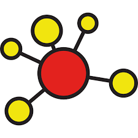

```{r setup, include=FALSE}
knitr::opts_chunk$set(echo = TRUE)
```

## 1. Prepare

Our Unit 2 Case Study: Collaboration revisits some of excellent research
by Dr. Alan Daly and centers around the impact No Child Left Behind
reform efforts on school and district leadership networks. In this unit
we move beyond visual depictions of networks using sociograms from our
previous SNA case study and learn to describe networks using a wide
range

> **Mathematical approaches** focus on what a network of actors "looks
> like" by describing the network using sociograms and/or network
> measures such as reciprocity, centrality, and density.

In addition to investigating tweets around the these controversial state
standards, our Unit 2 Walkthrough will cover the following topics
pertaining to each data-intensive workflow process:

1.  **Prepare**: Prior to analysis, we'll take a look at the context
    from which our data came, formulate some research questions, and get
    introduced the {rtweet} R package for using the Twitter API.

2.  **Wrangle**: Wrangling data entails the work of manipulating,
    cleaning, transforming, and merging data. In section 2 we will learn
    about the {tidygraph} package for creating network objects.

3.  **Explore**: In section 3, we use the {tidygraph} package and the
    companion {ggraph} package to calculate a range of centrality
    measures and learn how to illustrate some of these stats through
    network visualization.

4.  **Model**: We wrap up our analysis in Section 4 by introducing
    community detection and sentiment analysis algorithms for
    identifying groups and gauging sentiment about the common core.

5.  **Communicate**: We briefly reflect on our walkthrough in
    preparation for our independent analysis next week.

### 1a. Review the Research

In [Social Network Analysis and Education: Theory, Methods &
Applications](https://methods.sagepub.com/book/social-network-analysis-and-education)
@carolan2014 makes the following distinctions between mathematical and
statistical approaches to social network analysis:

Specifically, we will try to replicate the P\* models used in Chapter 9
of @carolan2014 in order to test hypotheses about individual and network
characteristics that may explain who school leaders select for
collaboration and confidential exchanges.

#### Research Questions

For this walkthrough, we will be using school leadership data were
collected at two school districts over 3 consecutive years that was used
to answer the following research questions:

1.  Is there a relationship between the frequency of collaboration
    between school leaders and how often they turn to each other to
    discuss issues of a confidential nature?
2.  Do school leaders prefer to collaborate with those with whom they
    have collaborated in the past, or is there some other reason?
3.  Does gender or some other individual attribute predicts confidential
    exchanges between school leaders, or does some previous relation
    have a stronger effect?
4.  Does collaboration between leaders explain one's level of trust in
    one's administrative colleagues?
5.  Can we distinguish among different groups of school leaders based on
    how frequently they collaborate, and if so, are these groupings
    related to the level at which they work (school versus district)?

#### Data Collection

For each consecutive year, school district leaders were invited to
complete a survey that collected individual:

-   **Demographic information** (e.g., gender, ethnicity, marital
    status, age, years of experiences);

-   **Network relationships types** (e.g., collaboration, confidential
    exchanges, energy, expertise, leaders approached for support,
    work-related issues, input, recognition, best practices, and
    innovation);

-   **Frequency of interactions** they have with those nominated
    individuals on a four-point frequency scale ranging from 1 (the
    least frequent) to 4 (1--2 times a week);

-   **Leadership efficacy** items were designed based on the Principal
    Efficacy Scale used in Daly et al. (2011) and Tschannen-Moran and
    Gareis's (2004) studies. The efficacy scale includes 18 items rated
    on a 9-point Likert scale ranging from 1 (None at all) to 9 (A great
    deal);

-   **Trust** scale contains eight items rated on a 7-point Likert scale
    ranging from 1 (Strongly disagree) to 7 (Strongly agree) modified
    from Tschannen-Moran and Hoy (2003).

#### Analyses

#### Key Findings

In response to research questions 1 & 2 from above, Carolyn reported
that "while collaboration in year 1 does not significantly predict
collaboration in year 3, confidential exchanges in year 1 does" and
suggested that "collaboration among school leaders provides an important
foundation for more sensitive, perhaps even deeper, relations (e.g.,
confidential exchanges) at a later point in time."

### 

For our Unit 3 Walkthrough, we focus specifically on generative
processes, or micro-level mechanisms, the might help explain who school
leaders select to collaborate with or engage in confidential exchanges.
Review Chapter 9 of SNA and Education and report out on the findings
from the ERGM analysis in response to Research Question 3 below:

3.  **Does gender or some other individual attribute predicts
    confidential exchanges between school leaders, or does some previous
    relation have a stronger effect?**

    -   YOUR RESPONSE HERE

Based on what you know about networks and the context so far, what other
specific question(s) might the data and analyses described allow you to
address. For example, the concept of homophily, or the tendency for
people to seek out or form ties to those who are similar to themselves,
was introduced in our readings and hypotheses about homophily can easily
be tested using using ERGMs:

-   YOUR RESPONSE HERE

Save this question for later as you'll have a chance to empirically test
it by the end of this walkthrough.

In Unit 1, we also learned about **packages**, or libraries, which are
shareable collections of R code that can contain functions, data, and/or
documentation and extend the functionality of R. You can always check to
see which packages have already been installed and loaded into RStudio
Cloud by looking at the the Files, Plots, & Packages Pane in the lower
right hand corner.

### **👉 Your Turn** **⤵**

### 1b. Load Libraries

Recall that R [**packages**](https://en.wikipedia.org/wiki/R_package),
sometimes referred to as libraries, are shareable collections of R code
that can contain functions, data, and/or documentation and extend the
functionality of R. Before loading an R package, you must first make
sure it has been installed in your environment. You can always check to
see which packages have already been installed and loaded into RStudio
Cloud by looking at the the Files, Plots, & Packages Pane in the lower
right hand corner.

Let's go ahead and load the [tidyverse](https://www.tidyverse.org/),
[igraph](https://igraph.org/),
[tidygraph](https://www.data-imaginist.com/2017/introducing-tidygraph/),
and [ggraph](https://ggraph.data-imaginist.com/index.html) packages from
our previous SNA unit since we'll be using them again in this case
study:

Load Packages

```{r libraries}
library(readxl)
library(tidyverse)
library(igraph)
library(tidygraph)
library(ggraph)
```

Next, we will introduce a few new packages that will help us with our
social network analyses.

#### tidygraph 📦

{width="20%"}

The {[tidygraph](https://tidygraph.data-imaginist.com/)} package is a
huge package that exports 280 different functions and methods, including
access to almost all of the `dplyr` verbs plus a few more, developed for
use with relational data. While network data itself is not tidy, it can
be envisioned as two tidy tables, one for node data and one for edge
data. The {tidygraph} package provides a way to switch between the two
tables and uses `dplyr` verbs to manipulate them. Furthermore it
provides access to a lot of graph algorithms with return values that
facilitate their use in a tidy workflow.

Let's go ahead and load the {tidygraph} library:

#### ggraph 📦

{width="20%"}

Created by the same developer as {tidygraph},
{[ggraph](https://ggraph.data-imaginist.com/index.html)} -- pronounced
gg-raph or g-giraffe hence the logo -- is an extension of
{[ggplot](https://ggplot2.tidyverse.org/)} aimed at supporting
relational data structures such as networks, graphs, and trees. Both
packages are more modern and widely adopted approaches data
visualization in R.

While ggraph builds upon the foundation of ggplot and its API, it comes
with its own self-contained set of geoms, facets, etc., as well as
adding the concept of *layouts* to the [grammar of
graphics](https://ggplot2-book.org/introduction.html?q=grammar#what-is-the-grammar-of-graphics),
i.e. the "gg" in ggplot and ggraph.

Let's go ahead and load the {ggraph} library:

```{r}

```

#### igraph 📦

{width="20%"}

Both {tidygraph} and {ggraph} depend heavily [igraph network analysis
package](https://igraph.org/). The main goals of the igraph package and
the collection of network analysis tools it contains are to provide a
set of data types and functions for:

1.  pain-free implementation of graph algorithms,

2.  fast handling of large graphs, with millions of vertices (i.e.,
    actors or nodes) and edges,

3.  allowing rapid prototyping via high level languages like R.

Run the code chunk below to load the {igraph} library:

Hide

    library(igraph)

#### readxl 📦

{width="20%"}

The [{readxl}](https://readxl.tidyverse.org/) package makes it easy to
get data out of Excel and into R. Compared to many of the existing
packages (e.g. gdata, xlsx, xlsReadWrite) readxl has no external
dependencies, so it's easy to install and use on all operating systems.
It is designed to work with *tabular* data.

Since one of our data wrangling steps in the next section is importing
network matrices stored in excel files, the package will come in handy.

### 👉 Your Turn ⤵

Use the code chunk below to load the

```{r}

```

Section 1a. Questions:

1.  

## 2. Wrangle

You can also embed plots, for example:

### 2a. Import Data

One of our primary goals for this case study is to examine how
collaboration networks among school and district leaders changed over
time. To do so, we'll need to import two Excel files from the [Social
Network Analysis and Education companion
site](https://studysites.sagepub.com/carolan/study/resources.htm). Both
files contain edges stored as a square matrix (more on this later) for
the first and third year of a study examining the impact of national
reform efforts [@daly2010bridge].

These files are included in the data folder of your R Studio project. A
description of each file from the companion website is linked above and
each data file is linked below:

1.  [**School Leaders Data Chapter
    9_a.**](https://studysites-sagepub-com.prox.lib.ncsu.edu/carolan/study/materials/datasets/99472_ds7.xls) This
    adjacency matrix reports on "collaboration" ties among 43 school
    leaders in year 1 of a three-year study. This is a directed valued
    (weighted) network measured on five-point scale ranging from 0 to 4,
    with higher values indicating more frequent collaborations (1--2
    times/week). These data are used throughout Chapter 9.

2.  [**School Leaders Data Chapter
    9_b.**](https://studysites-sagepub-com.prox.lib.ncsu.edu/carolan/study/materials/datasets/99472_ds8.xlsx) This
    adjacency matrix reports on "collaboration" ties among 43 school
    leaders in year 3 of a three-year study. This is a directed valued
    (weighted) network measured on five-point scale ranging from 0 to 4,
    with higher values indicating more frequent collaborations (1--2
    times/week). 

Recall from above that our relations, or edges, are stored as a valued
[adjacency matrix](https://en.wikipedia.org/wiki/Adjacency_matrix) in
which columns and rows consist of the same actors and each cell contains
information about the tie between each pair of actors. In our case, the
tie is a directed and valued "arc" where the value indicates the
strength of the relationship.

Use the `read_excel()` function to import the
`School Leaders Data Chapter 9_d.xlsx` file, add an argument setting the
column names to `FALSE` since our file is a simple matrix with no header
or column names, and assign the matrix to a variable named
`leader_matrix`:

**Hint:** Type `?read_excel` into the console and check the arguments
section to find the name of the argument used to set column headers.

```{r import year }

year_1_collaboration <- read_excel("data/year_1_collaboration.xlsx", 
                            col_names = FALSE)
```

Use the code chunk below to inspect the matrix you just imported and
answer the questions that

```{r}
class(year_1_collaboration)

year_1_collaboration
```

### 2b. Create a Tidy Graph

Meet , we first need to convert it to a matrix object recognized by R
using the `as.matrix()` function. We can then check to data format of
our `leader_matrix` using the `class()` function:

```{r}
year_1_matrix <- year_1_collaboration |>
  as.matrix()

class(year_1_matrix)

year_1_matrix
```

\

#### Add Row and Column Names

Before we can convert to network object, we will also need to assign
names of our nodes to the columns and rows of our matrix.

These are stored in the `ID` column of our `leader_node` data frame. We
can use the `$` operator to select these names and assign to our
`leader_matrix` using the `rownames()` and `colnames()` functions
respectively:

```{r}
rownames(year_1_matrix) <- 1:43

colnames(year_1_matrix) <- 1:43

year_1_matrix
```

#### Network Object

object

```{r}


year_1_network <- as_tbl_graph(year_1_matrix, directed = TRUE)

year_1_network

```

### 👉 Your Turn ⤵

Use the code chunk below to complete the following data wrangling steps
for our Year 3 collaboration network:

1.  Import the Excel file from data folder in the files pane and save as
    a new R object;

2.  Convert the resulting data frame to a matrix class object and check
    to confirm that it is indeed a matrix;

3.  Add row and column names to the matrix;

4.  Convert the matrix to a network class object with directed edges;

5.  Inspect the Year 3 collaboration network and answer the questions
    after the code chunk.

```{r}
#YOUR CODE HERE
year_3_collaboration <- read_excel("data/year_3_collaboration.xlsx", 
                            col_names = FALSE)


year_3_matrix <- year_3_collaboration |>
  as.matrix()

rownames(year_3_matrix) <- 1:43

colnames(year_3_matrix) <- 1:43

year_3_network <- as_tbl_graph(year_3_matrix, directed = TRUE)

year_3_network


```

Section 2 Questions:

1.  What is the size of the Year 3 collaboration network?

    -   

2.  How many components are in this network?

    -   

3.  How many nodes and edges variables are in our tidy graph and what
    does each variable (e.g., weight) represent?

    -   

4.  How does collaboration in Year 3 compare to Year 1 and what
    inferences might you already be able to make just based on the size
    of the two networks?

    -   

5.  

## 3. Explore

Relevant to our case study of school leader collaboration, Carolyn notes
in SNA and Education @carolan2014 that:

> ... to address questions that probe a network's dynamics (i.e., its
> change over time), it is necessary to first figure out what the
> network looks like at one point in time, what is commonly referred to
> as the network's topography.

In order to describe a network's **topography**, social network
researchers utilize an array of algorithms and indices to describe both
visually and numerically different characteristics of social networks.
These algorithms and indices rely on both simple and somewhat
sophisticated mathematical computation.

In this section we revisit the {tidygraph} and {ggraph} packages for
creating sociograms and computing basic node and edge-level measures and
introduce some key functions from the {igraph} package for obtaining
complete network-level measures.

### 3a. Visually Describe the Network

One of the defining characteristics of the social network perspective is
its use of graphic imagery to represent actors and their relations with
one another. To emphasize this point, Carolyn (2013) reported that:

> The visualization of social networks has been a core practice since
> its foundation more than 90 years ago and remains a hallmark of
> contemporary social network analysis. 

Network visualization can be used for a variety of purposes, ranging
from highlighting key actors to even serving as works of art. Katya
Ognyanova's also excellent tutorial on [Static and Dynamic Network
Visualization with R](https://kateto.net/network-visualization/) helps
illustrate the variety of goals a good network visualization can
accomplish.

Recall from our previous SNA case study examining Twitter networks
surrounding the Common Core State Standards that we introduced the dead
simple
[`plot()`](https://www.rdocumentation.org/packages/graphics/versions/3.6.2/topics/plot)
function built into R to quickly generate a sociogram showing the nodes
and edges in our network.

Let's supply our `year-1-network` object as the first argument of this
function and see what it produces:

```{r plot}

plot(year_1_network)

```

While not the most aesthetically pleasing plot, it definitely is
functional. As indicated by our tidy graph output from section 1, we can
see that there is one large network component and two additional
components consisting of isolated school leaders with no collaboration
ties.

If this had been a larger network with more nodes and edges, however,
the utility of the basic `plot()` function would evaporate quickly. For
example, try this function out with the Year 3 network in the console
and see what it produces.

Fortunately, the {ggraph} package includes a plethora of plotting
parameters for graph layouts, edges and nodes to improve the visual
design and readability of network graphs.

### **Sociograms with ggraph**

One thing to keep in mind when building a network viz with the {ggraph}
package is that just like it's {ggplot} counterpart for making more
traditional charts and graphs, there is a minimal code template for
producing a basic plot. Specifically, ggraph requires 3 main functions

-   [`ggraph()`](https://ggraph.data-imaginist.com/articles/Layouts.html)
    takes care of setting up the plot object along with creating the
    layout of the graph (default = "stress").

-   [`geom_node_*()`](https://ggraph.data-imaginist.com/articles/Layouts.html)
    functions and their associated arguments add and modify the nodes of
    the network plot.

-   [`geom_edge_*()`](https://ggraph.data-imaginist.com/articles/Edges.html)
    functions and their associated arguments add and modify the edgez of
    the network plot.

Like the basic plotting function above, ggraph has a similar
`autograph()` function for automatically generating a simple sociogram
to get a quick snapshot of your network. Run the following code
supplying our `year_1_network` object as the first argument for this
function: \

```{r autograph}

autograph(year_1_network)

```

As you can see, this produces a very basic plot that includes our
network nodes and edges with minimal styling.

WIthing this function, however, are the three core functions noted above
that can be modified though different arguments or by adding additional
layers of functions to change the visual aesthetics of your sociogram to
highlight key characteristics of the network, like edge weight or
central actors.

Let generate the same basic plot above but explicitly call our ggraph,
node, and edge functions:

```{r}

ggraph(year_1_network) +
  geom_node_point() +
  geom_edge_link()

```

We won't spend a lot of time on styling our graph here. We will save
that effort for when we're ready to communicate our findings to a
specific audience, but lets make some quick functional and aesthetic
changes: Run the following code to:

-   Change the graph layout to the Fruchterman-Reingold (FR) layout
    using the `layout = "fr"` argument to help highlight areas of
    clustering;

-   Change the size of our nodes using the `size = 3` argument to make
    them more visible;

-   Add color to our edges based using the `aes(colour = weight)`
    argument to highlight more frequent collaborations; and,

-   Add the `theme_graph()` layer to remove the gray background.

```{r}

ggraph(year_1_network, layout = "fr") +
  geom_node_point(size = 3) +
  geom_edge_link(aes(colour = weight)) +
  theme_graph()
  

```

That is perhaps slightly better, but before sharing with an education
partner, I would likely do quite a bit more clean up to highlight key
findings specific to network measures that we'll explore in the next
section. For example, I might change the size of nodes for school
leaders based on measures of centralization to highlight more central
actors in the network and add arrows to indicate directionality of the
ties since this is a directed network.

### 👉 Your Turn ⤵

Use the code chunk below created a simple sociogram for the Year 3
collaboration network and answer the questions that follow:

```{r year_3_sociogram}


ggraph(year_3_network, layout = "fr") +
  geom_node_point(size = 3) +
  geom_edge_link(aes(colour = weight)) +
  theme_graph()


```

1.  How does the Year 3 collaboration network compare to Year 1? What
    are some similarities and differences?

    -   

2.  How might you modify this graph to make it more insightful and
    useful to

    -   

### 3b. Describe the Network Mathematically

This section include some of the most common measures used to describe
the features of complete networks, as well was .

> Network-level structural measures are those that are calculated from
> the entire network. Therefore, they provide an excellent snapshot of
> the network's structure---the pattern of relations among the network's
> actors.

In addition to providing an overall summary of the network, these
measures provide a concrete means to compare relations such as whether
the friendship, social support, and advice seeking networks within the
same fraternity, for example, are comparable. In our case study, for
example, were are

#### Network Size

One simple but important property of a social network is its size, or
the number of nodes and edges in a network. As Carolan notes:

> Size plays an important role in determining what happens in the
> network--- what resources are exchanged among actors, for example...
> Size affects other network measures, but on a conceptual level, it
> influences the structure of relations, as actors only have so many
> resources and capacities for creating and maintaining ties with
> others.

```{r}

year_1_network


year_1_network |>
  gsize()

gsize(year_1_network)


```

#### Density

Density is intricately linked to network size.

> Density refers to the number of ties in the network reported as a
> fraction of the total possible number of ties... The closer this
> number is to 1.0, the denser the network.

\

```{r}

year_1_network |>
  edge_density()

edge_density(simplify(year_1_network))

graph.density(year_1_network)
```

#### Reciprocity

A third network measure that indicates an aspect of the networks social
structure is reciprocity, defined as the degree to which actors in a
directed network select one another. Stated another way, reciprocity
indicates the mutuality of the network's ties (this is why reciprocity
is also referred to as mutuality).

This property is important because it reveals the direction through
which resources such as help, advice, and support flow. It also
indicates the network's stability, as reciprocated ties tend to be more
stable over time. Finally, networks with high reciprocity may be more
"equal," while those with lower reciprocity may be more hierarchical.
While some relations are by definition reciprocal, such as "studied
with," others such as friendship are potentially asymmetrical and
indicate imbalances in influence, status, or authority. Borgatti,
Everett, and Freeman (2006) provide the following measure of
reciprocity: where Aij indicates a tie from actor i to j. A high degree
of reciprocity means that a network's actors choose one another. It
could also mean that while some actors choose one another, they are not
choosing others, which results in a high degree of clustering within the
network. At the complete network level, reciprocity is reported as the
proportion of reciprocated ties in the network. Therefore, values closer
to 1.0 indicate higher reciprocity. Applying Equation 5.3 to the
Fraternity Data, reciprocity for the entire network is 0.31, indicating
that slightly less than one-third of all ties are mutual. This low value
should be considered unsurprising, as this particular network snapshot
was taken at the beginning of the study, well before the participants
got to know each other. One could reasonably expect that the network's
reciprocity, as well as its density, will increase over time, which
would be associated with a greater likelihood of engaging in behavior
together and sharing similar attitudes. For example, Moolenaar and
Sleegers (2010) hypothesize that teacher networks with high reciprocity
would be positively associated with teachers' perceptions of their
schools' innovative climate and trust. Their analyses, however, do not
support this hypothesis. According to their models, dense networks SAGE
2014 SAGE Publications, Ltd. All Rights Reserved. SAGE Research Methods
Page 7 of 13 Structural Measures for Complete Networks (on two different
network relations: "discuss work" and "regard as friend") are
significantly related to both a teacher's perceptions of trust and the
school's innovative climate, while reciprocity is not. However, despite
this null finding, others have shown that networks with high reciprocity
are associated problem solving and the exchange of complex knowledge
(Uzzi & Spiro, 2005) but are also associated with less desirable
outcomes such as risky drug and sexual behaviors (Valente & Vlahov,
2001).

```{r}

year_1_network |>
  reciprocity()

year_1_network |>
  activate(edges) |>
  mutate(reciprocated = edge_is_mutual()) |>
  as_tibble()


```

#### Transitivity

Transitivity is another feature of complete networks that reflects the
social structure's tendency toward stability and consistency. Whereas
reciprocity focuses on the ties between two actors (dyads), transitivity
is based on the triad, any "triple" of actors. The addition of this
third "other" reflects a more authentic character of social life and has
been the basis for much theorizing about social networks (Simmel,
1908/1950). Much of this theorizing revolves around a triad's tendency
toward transitivity: if Teacher A collaborates with Teacher B and
Teacher B collaborates with Teacher C, then Teacher A collaborates with
Teacher C. In this instance, the triad is considered transitive because
Teachers A and B have the same relationship with C.

Valente (2010) notes that early theorizing about this tendency focused
on the concept of balance, first introduced by Heider (1958) to explain
a person's observed preference for equilibrium with the people around
them. The theory of cognitive dissonance grew out of this work,
attempting to explain how people felt when their immediate environment
was unbalanced (Festinger, 1954). The argument then extended to
postulate that increasing the number of transitive triads of which one
is a part could reduce cognitive dissonance. Even Granovetter's strength
of weak ties theory (1973) emerged from this work, showing that
intransitive triads are relatively rare, resulting in networks with
fewer weak ties. The paradox, of course, is that the relative paucity of
weak ties is what makes them "strong," as they provide early access to
diverse information.

Measuring triadic relations within a network of undirected (symmetric)
relations is straightforward (Hanneman & Riddle, 2011b). There are only
four possible types of triadic relations: no ties, one tie, two ties, or
all three ties. Performing what is called a "triad census" on these data
can reveal the extent to which the network can be characterized as
consisting of isolates (actors not connected to any other actors), dyads
(actors who are only connected to one other actor), structural holes
(one actor connected to two others who, in turn, are not connected to
each other), and clusters (groups of three actors that are all connected
to each other). With undirected data, one can simply count how often
each of these four types occurs across all possible triples.

However, things get more interesting when performing a triad census on
directed data, such as the transformed Fraternity Data. There are 16
possible types of relations among any three of the network's actors
(Holland & Linehardt, 1979). Different forms of relationships can be
observed among these groups, including hierarchy, equality, and
exclusivity. This is one of the reasons why researchers with an interest
in social group relations suggest that the most fundamental forms of
social relationships can be observed at the triadic level.

A triad census for a network with directed data counts the proportion of
triads that fall within each of these 16 categories. These categories
are typically called MAN categories, which reflects the number of mutual
(M), SAGE 2014 SAGE Publications, Ltd. All Rights Reserved.

SAGE Research Methods Page 8 of 13 Structural Measures for Complete
Networks asymmetric (A), and null (N) ties in each triad. Therefore, a
triad with a code of 111 would have one mutual tie, one asymmetric, and
one null tie, indicating that one actor serves as a go-between for the
triad's other two actors. Of these 16 possible types of directed triads,
only four can be classified as transitive (Wasserman & Faust, 1994). In
the Fraternity Data there are, for example, five 030 triads (zero
mutual, three asymmetric, and zero null ties); these triads are
considered transitive because Students 1 and 2 have the same
relationship to 3.

Going one step further, a transitivity analysis divides a network's
number of transitive triads by the number of triads of all kinds. More
formally, the density of transitive triples is the number of triples,
which are transitive, divided by the number of paths of length two
(i.e., the number of triples that have the potential to be transitive).

In the Fraternity Data, this value is 10.70%. This lack of transitivity
suggests that there are numerous null ties, indicating a relatively
sparse network in which resources will have difficulty flowing from one
part of the network to another. This is not too surprising given that
these relations were measured at the start of the study (week 1) and, as
a result of the data transformation, each actor has three out-degrees
(that is, they sent three friendship nominations). Here, too, this can
be attributed to a measurement issue. Faust (2008) has shown that
fixed-choice survey instruments (recall that these manipulated data
"fixed" the number of friendship nominations to three), artificially
limit the triad census and the subsequent analysis of transitivity.
Regardless, establishing a network's transitivity is important, as it is
theoretically connected to actors' tendencies to divide into exclusive
subgroups over time, especially relational data that capture positive
affect, such as friendship.

```{r transitivity}

year_1_network |>
  transitivity()
```

```{r}
count_triangles(year_1_network)
```

```{r}
triad_census(year_1_network) |>
  as_tibble()
```

#### Diameter and Distance

Similarly, the next two network-level properties, diameter and distance,
also indicate how well resources can move from one part of the network
to another. Whereas transitivity focuses on the importance of certain
configurations of triads, these two related concepts are more
straightforward. A network's diameter refers to the longest path between
any two actors. This property is important, as networks that have the
same size (equal numbers of actors) and even the same density (equal
percentages of ties present) can have different diameters. Consider the
network's diameter in Figure 5.1. The length of the longest path between
two actors is five. To "get from" Student 15 to 16 in this directed
network requires five steps: 15 ? 5 ? 17 ? 4 ? 2 ? 16.

This is the only five-step path in the network and is the maximum
distance between any two actors.

Related to this is another property that captures how "far" actors are
from one another. The average path length measures the mean distance
between all pairs of actors in the network. When this value is small,
this indicates that there is a cohesive network with minimal clustering.
Conversely, when this value is high, the network likely has little
cohesion, thereby making it difficult for resources---whether these
resources be advice, trust, information, or the like---to move from one
part of the network to another. The average path length in the
Fraternity Data is 2.18. The interpretation of this is that, on average,
all students in the network are slightly more than two steps from
everyone else in the network, assuming they could reach one another (an
assumption that is incorrect given that there are no paths between some
pairs of students). To calculate SAGE 2014 SAGE Publications, Ltd. All
Rights Reserved.

SAGE Research Methods Page 9 of 13 Structural Measures for Complete
Networks this, you first have to identify the distances between each
pair of actors in the network and then calculate the average of all
these pairs.

Both diameter and average path length are important network-level
structural properties. Valente (2010) goes as far as to note that you
need not know anything else about a network's topography to draw several
important conclusions. For example, a network with a large diameter and
small average path length suggests a structure in which there are parts
of the network that some network actors may be unable to access.

```{r diameter}
diameter(simplify(year_1_network))
```

```{r distance}

distances(year_1_network) |>
  as_tibble()

distance_table(year_1_network)
```

```{r}
mean_distance(year_1_network)
```

#### Clustering

Another structural network-level property that is of interest to network
researchers is a network's clustering.

Clustering is a measure of a network's actors' tendency to "group
together" into pockets of dense connectivity (Valente, 2010). High
clustering indicates that there are numerous pockets in which some
actors are connected to each other but not to others. Low clustering, on
the other hand, suggests that relations are more evenly distributed
across the network with very few pockets of dense connectivity among
subsets of actors. The tendency, of course, is for people to interact
with a fairly small set of actors who share similar attributes---the
"birds of a feather flock together" (homophily) phenomenon. Knowing the
degree to which actors cluster says a great deal about the structure of
these everyday relations, a structural pattern that may even seem
somewhat paradoxical (Watts, 1999). This is related, in part, to what is
referred to as the smallworld phenomenon.

The small-world phenomenon combines two ideas (Valente, 2010). The first
is a network with a short average path length. That is, relatively few
steps connect each pair of actors, on average. The second part of this
is that "small-world" networks also have a high degree of
clustering---groups of actors who interact almost exclusively in their
own immediate "neighborhoods." This second part is the network's
tendency to form dense local pockets of connectivity: clusters. "Small
worlds" are those that paradoxically have a low average path length but
high clustering.

Measuring the extent to which a network displays clustering involves two
steps. First, one calculates the density of each actor's local
neighborhood (the density of each ego's network, which equals the total
number of ties present divided by the total number of possible ties).
Then, after doing this for all actors in the network, the degree of
clustering can be characterized by the average of all the ego
neighborhoods in the complete network.

```{r}
clusters(year_1_network)
```

#### Centralization

A final structural property of complete networks is centralization. A
network that is highly centralized is one in which relations are focused
on one or a small set of actors. This is, however, different than a
structural property such as density, which measures the presence of
relations, not whether they are focused on a small set of actors. In
other words, a network can be dense but have low centralization (many
relations that are spread evenly across the network's actors) and vice
versa (few relations that are concentrated on a small set of actors).
Networks that are centralized, regardless of their density, are ones in
which only a small and exclusive set of actors hold positions of power
and control. Decentralized networks, conversely, are those in which
power and control are diffuse and spread over a number of actors.

Centralization can be based on a number of metrics (these are discussed
in Chapter 7 when individual ego centrality measures are introduced),
with degree being one of the most common (Freeman, 1979). Degrees refers
to the number of ties an actor either sends (out-degree) or receives
(in-degree). Valente (2010) summarizes the calculation of network
centralization.

> A network's centralization affects the process through which resources
> traverse the network... high centralization provides fewer actors with
> more power and control.

Imagine if Students 12, 11, and 17 have information about what was to be
included on an upcoming exam. Their location can either accelerate or
prevent the spread of that information to other students. These central
actors likely wield a disproportionate amount of influence on the
network. Therefore, high centralization provides fewer actors with more
power and control.

```{r}
year_1_network |>
  activate(nodes)|>
  mutate(degree = centrality_degree(mode = "all")) |>
  centalizatio.degree
```

```{r}
centralization.degree(year_1_network, mode = "all")
```

## 4. Model

A third developing area of network research that makes use of advanced
statistical tools focuses on the examination of network change over
time. These models show how networks evolve and whether there are
actor-level characteristics associated with this evolution. These models
are increasingly important, as it is obvious---or, at least it should
be---that social networks are dynamic by nature. Ties are established
between actors, they may flourish and perhaps evolve into close
relationships, and they can also dissolve quietly or suddenly (Snijders,
van de Bunt, & Steglich, 2010). These relational changes may be
considered the result of the structural positions of the actors within
the network---for example, when friends of friends become
friends---characteristics of the actors (actor covariates such as
gender), characteristics of pairs of actors (dyadic covariates such as
whether there is a tie), and residual random influences representing
unexplained influences.

Not only test whether changes observed in a network over time, but also
model how they have changed and potential mechanisms driving those
changes.

Two modeling techniques unique to network analysis and demonstrated in
Chapter 9 of \@carolan2014 are the quadratic assignment procedure (QAP)
and Exponential Random Graph Models (ERGM):

-   **QAP/MR:** The quadratic assignment procedure (QAP) developed by
    Hubert (1987) and Krackhardt (1987b) tests the null hypothesis of no
    correlation between the two networks and adjusts for this dependence
    between networks by repeatedly permuting the order of rows and
    columns of one of the networks while keeping the other network
    intact. The QAP is based on regression models and permutation tests
    for valued (i.e., continuous) relational variables.

-   **P1 and P\* (P-Star):** Both of these models are some of the first
    to make use of the ERGM, which provides a basis for comparing
    whether a network's observed structural properties occur more
    frequently than you could expect from chance alone. ERGMs can be
    used to model ties in complete networks but do so in a manner that
    explains the presence (or absence) of ties as a function of
    individual-and/or network-level characteristics. While QAP and
    MR-QAP procedures control for network structure through
    permutations, these ERGMs attempt to explain it.

## 5. Communicate
