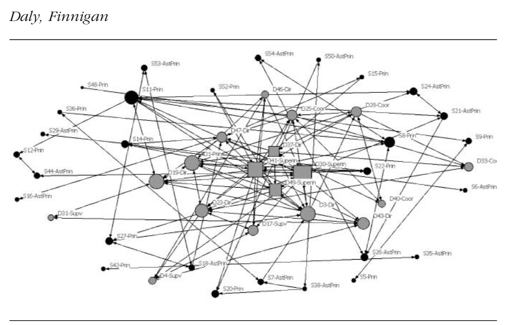

class: clear, title-slide, inverse, center, top, middle

```{r setup, include=FALSE}
knitr::opts_chunk$set(echo = FALSE)
```

```{r, echo=FALSE}
# then load all the relevant packages
pacman::p_load(pacman, knitr)
```

```{r xaringan-panelset, echo=FALSE}
xaringanExtra::use_panelset()
```

```{r xaringanExtra-clipboard, echo=FALSE}
# these allow any code snippets to be copied to the clipboard so they 
# can be pasted easily
htmltools::tagList(
  xaringanExtra::use_clipboard(
    button_text = "<i class=\"fa fa-clipboard\"></i>",
    success_text = "<i class=\"fa fa-check\" style=\"color: #90BE6D\"></i>",
  ),
  rmarkdown::html_dependency_font_awesome()
)
```
```{r xaringan-extras, echo=FALSE}
xaringanExtra::use_tile_view()

```

# `r rmarkdown::metadata$title`
----
### `r rmarkdown::metadata$author`
### `r format(Sys.time(), "%B %d, %Y")`

---
# Agenda

.pull-left[
## Conceptual Overview
Data Logistics
- Collection
- Management  
- Quality  
]

.pull-right[
## R Code-Along
Network Measurement 
- Density
- Centrality 
- Reciprocity

]


---
# New Slide


.footnote[
Krumm, A. et al. (2018). [Learning analytics goes to school.](https://www.taylorfrancis.com/books/mono/10.4324/9781315650722/learning-analytics-goes-school-andrew-krumm-barbara-means-marie-bienkowski).
]
---
class: clear, inverse, middle, center

# RStudio Code-Along


Network Measures

---
# Guiding Literature

.panelset[

.panel[.panel-name[Context]

.pull-left[This longitudinal case study draws upon SNA to **examine the reform-related knowledge, advice, and innovation network structures of central office and site leaders** in a district facing sanction for underperformance and engaging a districtwide reform.]

.pull-right[.center[]]


]

.panel[.panel-name[Questions]

This study involves quantifying and graphically displaying the ties and overall structure of informal networks to answer the following research questions: 

1. In what ways have reform-related social networks between district and site leaders evolved over a 2-year period? 
2. How do district and school leaders perceive the evolution of the social networks and its effect on the exchange of reform-related resources within the district?
]

.panel[.panel-name[Findings]

Findings indicate that over time, the networks **increased the number of superficial interactions**, but more frequent exchanges remained unchanged, resulting in a centralized network structure.
]


]


.footnote[
Daly, A. et al. (2011). The ebb and flow of social network ties between district leaders.
]

---
# Packages

.panelset[

.panel[.panel-name[Load Libraries]

Let's start by loading the following packages introduced in previous units:          

```{r load-libraries, message=TRUE, echo=TRUE}
library(readxl)
library(tidyverse)
library(tidygraph)
library(ggraph)
```


]

.panel[.panel-name[igraph 📦]

The {igraph} package and its collection of network analysis tools provide:

1. pain-free implementation of graph algorithms,
1. fast handling of large graphs, with millions of vertices and edges, and
1. rapid prototyping via high level languages like R.

Both {tidygraph} and {ggraph} depend heavily on the {igraph} package. 


]

.panel[.panel-name[Your Turn]

Load the {igraph} package.

```{r, echo=FALSE}
library(igraph)
```


]

]

---

# Network Density 

.panelset[

.panel[.panel-name[Definition]

TM has been largely used to **evaluate academic  performance** in different contexts, especially to assess essays and online assignments.

- writing style
- use of argumentation
- plagiarism detection
- peer interaction
]

.panel[.panel-name[Applications]
To help improve performance, TM is used to  **provide student feedback**, often based on both their interactions and activities 

- Intelligent Tutoring Systems
- Question-answering applications
- Assist teacher  feedback
- Support formative feedback

]

.panel[.panel-name[Implementation]
TM has been applied to **support student engagement and collaboration**, especially in distance learning courses. 

- Automated writing scaffolds
- Analysis of interactional resources
- Student sentiment extraction
- Dropout prevention
]

.panel[.panel-name[Your Turn]
Other applications of text mining in STEM Ed Research include: 
- Automatic text summarization
- Analytics & visualization tools
- Curriculum adaptation
- Recommendation systems
]


]


---
# Showing Your Code
```{r example-code, echo=TRUE}
example <- sum(0:9)
print(example)

# adding #<< after a line of code highlights it like this 
alphabet <- letters #<<
print(alphabet)
```


---
class: clear, wolfhead

.quote[Education is the most powerful weapon which you can use to change the world.]
.author[~ Nelson Mandela]


----

Four dashes puts a horizontal line on the slide to divide content.

---
class: clear, center

## .font130[.center[**Thank you!**]]
<br/>
.center[<br/>**Dr. Shaun Kellogg**<br/><mailto:sbkellog@ncsu.edu>]
