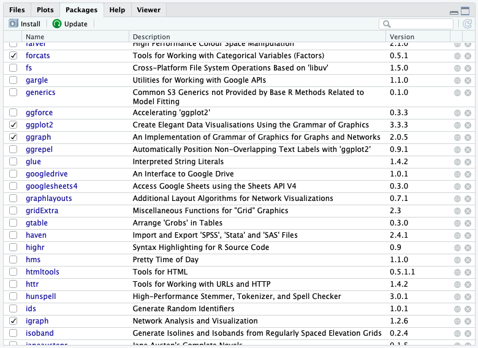

```{r setup, include=FALSE}
knitr::opts_chunk$set(echo = TRUE)
```

## 1. PREPARE

This week, our focus will be on preparing relational data for analysis,
putting together some basic network descriptives, and plotting a network
visualization to help illustrate key findings.

Specifically, the Unit 1 Walkthrough will cover the following topics:

1.  **Prepare**: Prior to analysis, we'll take a look at the context
    from which our data came, formulate some research questions, and
    load some by now familiar R packages for network analysis.

2.  **Wrangle**: Wrangling data entails the work of manipulating,
    cleaning, transforming, and merging data. In section 2 we focus on
    importing network data, converting our familiar data frames into a
    network object that can be analyzed and graphed, and learn about
    "simple graphs."

3.  **Explore**: In section 3, we calculate some basic network
    descriptives and learn how to illustrate some of these stats through
    network visualization.

4.  **Model**: While we won't dig into approaches for modeling network
    data until Unit 3, we will take a quick look at some approaches used
    in the study guiding this walkthrough.

5.  **Communicate**: We'll learn more about communicating key findings
    next week, but for now you will be introduced to the basic
    components of a data product.

### 1a. Review the Research

In [Social Network Analysis and Education: Theory, Methods &
Applications](https://methods.sagepub.com/book/social-network-analysis-and-education),
Carolyn (2013) notes that:

> the **social network perspective** is one concerned with the structure
> of relations and the implication this structure has on individual or
> group behavior and attitudes

More specifically, Carolyn cites the following four features used by
Freeman (2004) to define the social network perspective:

1.  Social network analysis is **motivated by a relational intuition**
    based on ties connecting social actors.

2.  It is firmly **grounded in systematic empirical data**.

3.  It **makes** **use of graphic imagery** to represent actors and
    their relations with one another.

4.  It **relies** **on** **mathematical and/or computational models** to
    succinctly represent the complexity of social life.

For Unit 1, our walkthrough will be guided by previous research and
evaluation work conducted by the Friday Institute for Educational
Innovation as part of the Massively Open Online Courses for Educators
(MOOC-Ed) initiative. The study introduced next and the hands-on
analysis with R in this walkthrough will help to illustrate these four
defining features of the social network perspective.

#### A Social Network Perspective in MOOC-Eds

{width="50%"}

Kellogg, S., Booth, S., & Oliver, K. (2014). [A social network
perspective on peer supported learning in MOOCs for
educators](https://github.com/sbkellogg/eci-589/blob/main/unit-1/lit/sna_mooc_irrodl_bjet_articles.pdf). *International
Review of Research in Open and Distributed Learning*, *15*(5), 263-289.

#### Research Context

In the spring of 2013, The Friday Institute launched the MOOC-Ed
Initiative to explore the potential of delivering personalized,
high-quality professional development to educators at scale (Kleiman et
al., 2013). In collaboration with the Alliance for Excellent Education,
the Friday Institute launched this initiative with a 6-week pilot course
called Planning for the Digital Learning Transition in K-12 Schools (DLT
1), which was offered again in September 2013 (DLT 2). This course was
designed to help school and district leaders plan and implement K-12
digital learning initiatives.

Academics, as well as pundits from traditional and new media, have
raised a number of concerns about MOOCs, including the lack of
instructional and social supports. Among the core design principles of
MOOC-Eds are collaboration and peer-supported learning. It is an
assumption of this study that challenges arising form this problem of
scale can be addressed by leveraging these massive numbers to develop
robust online learning communities.

This mixed-methods case study used both SNA and qualitative methods to
better understand peer support in MOOC-Eds through an examination of the
characteristics, mechanisms, and outcomes of peer networks. Findings
from this study demonstrate that even with technology as basic as a
discussion forum, MOOCs can be leveraged to foster these networks and
facilitate peer-supported learning. Although this study was limited to
two unique cases along the wide spectrum of MOOCs, the methods applied
provide other researchers with an approach for better understanding the
dynamic process of peer supported learning in MOOCs.

#### Data Sources

**MOOC-Ed registration form.** All participants completed a registration
form for each MOOC-Ed course. The registration form consists of
self-reported demographic data, including information related to their
professional role and work setting, years of experience in education,
and personal learning goals.

**MOOC-Ed discussion forums.** All peer interaction, including peer
discussion, feedback, and reactions (e.g., likes), take place within the
forum area of MOOC-Eds, which are powered by Vanilla Forums. Because of
the specific focus on peer supported learning, postings to or from
course facilitators and staff were removed from the data set. Finally,
analyses described below exclude more passive forms of interactions
(i.e., read and reaction logs), and include only postings among peers.

For our Unit 1 walkthrough, we'll take a look at data from the original
Digital Learning Transition in K-12 Schools (DLT 1) that was not
included in this study to allow for comparisons to the findings in this
study. For your independent analysis next week, you may want to consider
working with the DLT 2 data to see if you can replicate some of the
findings from this paper!

**Note**: In the data we're using, instructors have not yet been removed
and only direct replies to forum posts have been included, though
"weaker" ties like reactions with emoticons and even views of posts were
captured in this study.

#### **👉 Your Turn** **⤵**

Take a quick look at the *Description of the Dataset* section from the
[Massively Open Online Course for Educators (MOOC-Ed) network
dataset](https://github.com/sbkellogg/eci-589/blob/main/unit-1/lit/bjet_12312_Rev.pdf)
BJET article and the accompanying data sets stored on [Harvard
Dataverse](https://dataverse.harvard.edu/dataset.xhtml?persistentId=doi:10.7910/DVN/ZZH3UB)
that we'll be using for this walkthrough.

In the space below, type a brief response to the following questions:

1.  What were some of the steps necessary to construct this dataset?

    -   

2.  What "node attributes" are included in this dataset? How might they
    be used for analysis?

    -   

3.  What else do you notice/wonder about this dataset?

    -   

### 1b. Identify a Question(s)

A Social Network Perspective on Peer Supported Learning in MOOC-Eds was
framed by three primary research questions related to peer supported
learning:

1.  What are the patterns of peer interaction and the structure of peer
    networks that emerge over the course of a MOOC-Ed?

2.  To what extent do participant and network attributes (e.g.,
    homophily, reciprocity, transitivity) account for the structure of
    these networks?

3.  To what extent do these networks result in the co-construction of
    new knowledge?

For Unit 3, our exploratory analysis is guided RQ1 from the original
study with an additional emphasis on examining groups and key actors
that emerge in the discussion forums for the first and second
implementation of the Digital Learning Transition MOOC-Eds.
Specifically, for our case we're interested in the following questions:

1.  To what extent does group development differ between the first and
    second iteration of DLT 1 and DLT 2?
2.  What are the common attributes, if any, of central actors in the DLT
    1 & DLT 2 networks?

#### **👉 Your Turn** **⤵**

Based on what you know about networks and the context so far, what other
research questions might ask we ask in this context that a social
network perspective might be able to answer?

In the space below, type a brief response to the following questions:

\-

We'll revisit your response towards the end and provide an opportunity
to refine your research question after you know the data a little
better.

## 1c. Load Libraries

As highlighted in [Chapter 6 of Data Science in Education Using
R](https://datascienceineducation.com/c06.html#c06p) (DSIEUR):

> Packages are shareable collections of R code that can contain
> functions, data, and/or documentation. Packages increase the
> functionality of R by providing access to additional functions to suit
> a variety of needs.

#### The Packages Pane

You can always check to see which packages have already been installed
and loaded into RStudio Cloud by looking at the the Files, Plots, &
Packages Pane in the lower right hand corner of RStudio as shown in the
following screenshot:

{width="90%"}

You should see installed some familiar tidytext packages from our
[Getting Started
Walkthrough](https://sbkellogg.github.io/eci-589/unit-0/unit-0-walkthrough.html)
like {dplyr} and {readr} which we'll be using again shortly. You should
also see an important package call {igraph} that we will rely on heavily
for our network analyses in this course.

If you are working in RStudio Desktop, or notice that the packages have
not been installed and/or loaded, run the following `install.packages()`
function code to install the {tidyverse} and {igraph} packages:

```{r, eval=FALSE}
install.packages("tidyverse")
install.packages("igraph") 
```

Let's go ahead and use the `library()` function for the {tidyverse}
package and review which packages from the [tidyverse collection of
packages](https://www.tidyverse.org) that this package also loads.

Click the green arrow to run the following code and load our packages:

```{r}
library(tidyverse)
library(igraph)
library(tidygraph)
library(ggraph)
library(skimr)
```

#### **👉 Your Turn** **⤵**

Take a look at the messages from the output after loading the igraph
library. What tidyverse packages share identically named functions with
igraph?

Write your response in the space below.

-   Bb

## 2. WRANGLE

In general, data wrangling involves some combination of cleaning,
reshaping, transforming, and merging data (Wickham & Grolemund, 2017).
The importance of data wrangling is difficult to overstate, as it
involves the initial steps of going from the raw data to a dataset that
can be explored and modeled (Krumm et al, 2018).

For our data wrangling this week, we're keeping it simple since working
with network data is a bit of a departure from our working with
rectangular data frames. Our primary goals for Unit 1 are learning how
to:

a.  **Import Data**. An obvious and also important first step, we need
    to "read" our data into R and learn about formatting for edge-lists
    and node attribute files.

b.  **Create a Network Object**. Before performing network analyses,
    we'll need to convert our data frames into special data format for
    working with relational data.

c.  **Simplify Network**. Finally, we'll learn about a handy
    `simplify()` function in the {igraph} package for collapsing
    multiple ties between actors and removing "self-loops."

### 2a. Import Data

#### The Edge-List Format

To get started, we need to import, or "read", our data into R. The
function used to import your data will depend on the file format of the
data you are trying to import, but R is pretty adept at working with
many files types.

Take a look in the `/data` folder in your Files pane. You should see the
following .csv files:

-   `dlt1-edgelist.csv`

-   `dlt1-nodes.csv`

As its name implies, the first file `dlt1-edgelist.csv` is an edge-list
that contains information about each tie, or relation between two actors
in a network. In this context, a "tie" is a reply by one participant in
the discussion forum to the post of another participant -- or in some
cases to their own post! These ties between a single actor are called
"self-loops" and as we'll see later in this section, igraph has a
special function to remove these self loops from a sociogram, or network
visualization.

The edge-list format is slightly different than other formats you have
likely worked with before in that the values in the first two columns
each row represent a dyad, or tie between two nodes in a network. An
edge-list can also contain other information regarding the strength,
duration, or frequency of the relationship, sometime called "weight", in
addition to other "edge attributes."

In addition to our `Sender` and `Reciever` dyad pairs, our DLT 1 dataset
contains the following edge attributes:

-   `Sender` = Unique identifier of author of comment

-   `Receiver` = Unique identifier of identified recipient of comment

-   `Timestamp` = Time post or reply was posted

-   `Parent` = Primary category or topic of thread

-   `Category` = Subcategory or subtopic of thread

-   `Thread_id` = Unique identifier of a thread

-   `Comment_id` = Unique identifier of a comment\\

Let's use the `read_csv()` function from the {readr} package introduced
in the Getting Started walkthrough to read in our edge-list and print
the new `ties` data frame:

```{r}
dlt1_ties <- read_csv("data/dlt1-edgelist.csv", 
                 col_types = cols(Sender = col_character(), 
                                  Receiver = col_character(), 
                                  `Category Text` = col_skip(), 
                                  `Comment ID` = col_character(), 
                                  `Discussion ID` = col_character()))

dlt1_ties
```

Note the addition of the `col_types =` argument for changing the column
types to character strings since the numbers for those particular
columns indicate actors (`Sender` and `Reciever`) and attributes
(`Comment_ID` and `Discussion_Id`). We also skipped the `Category Text`
since this was left blank for deidentification purposes.

#### **👉 Your Turn** **⤵**

Consider the example pictured below of a discussion thread from the
Planning for the Digital Learning Transition in K-12 Schools (DLT 1)
where our data orginated. This thread was initiated by participant I, so
the comments by J and N are considered to be directed at I. The comment
of B, however, is a direct response to the comment by N as signaled by
the use of the quote-feature as well as the explicit mentioning of N's
name within B's comment.


Now answer the following questions as they relate to the DLT 1 edge-list
we just read into R.

1.  Which actors in this thread are the `Sender` and the `Reciever`?
    Which actor is both?

    -   

2.  How many dyads are in this thread? Which pairs of actors are dyads?

    -   

**Sidebar:** Unfortunately, these types of nuances in discussion forum
data as illustrated by this simple example are rarely captured through
automated approaches to constructing networks. Fortunately, the dataset
you are working with was carefully reviewed to try and capture more
accurately the intended recipients of each reply.

#### Node Attributes

The second file we'll be using contains all the nodes or actors (i.e.,
participants who posted to the discussion forum) as well as some of
their attributes such as gender and years of experience in education.

Carolyn (2013) notes that most social network analyses include variables
that describe attributes of actors, ones that are either categorical
(e.g., sex, race, etc.) or continuous in nature (e.g., test scores,
number of times absent, etc.). These attributes that can be incorporated
into a network graph or model, making it more informative and can aid in
testing or generating hypotheses.

These attribute variables are typically included in a rectangular array,
or dataframe, that mimics the actor-by-attribute that is the dominant
convention in social science, i.e. rows represent cases, columns
represent variables, and cells consist of values on those variables.

As an aside, Carolyn also refers to this historical preference by
researchers for "actor-by-attribute" data, in the absence of relational
data in which the actor has been removed their social context, as the
"sociological meatgrinder" in action. Specifically, this historical
approach assumes that the actor does not interact with anyone else in
the study and that outcomes are solely dependent of the characteristics
of the individual.

Now let's import the `dlt1-nodes.csv` attribute file and be sure to set
the following variables as character data types: `UID`, `Facilitator`,
`expert`, `connect`.

```{r}
dlt1_actors <- read_csv("data/dlt1-nodes.csv", 
                   col_types = cols(UID = col_character(), 
                                    Facilitator = col_character(), 
                                    expert = col_character(), 
                                    connect = col_character()))
```

#### 👉 Your Turn **⤵**

Use the code chunk below and a function of your choosing to import the
node and edge lists for and complete the matching exercise that follows:

```{r}


dlt2_actors <- read_csv("data/dlt2-nodes.csv", 
                   col_types = cols(UID = col_character(), 
                                    Facilitator = col_character(), 
                                    expert = col_character(), 
                                    connect = col_character()))

dlt2_actors
```

Match up the attributes included in the node file with the following
codebook descriptors. The first one has been done as an example.

-   `Facilitator` = Identification of course facilitator (1 =
    instructor)
-   Dummy variable for whether participants listed networking and
    collaboration with others as one of their course goals on the
    registration form
-   Identifier of "expert panelists" invited to course to share
    experience through recorded Q&A
-   Identification of course facilitator (1 **=** instructor)
-   Professional role (eg, teacher, librarian, administrator)
-   Years of experience as an educator
-   Works with elementary, middle, and/or high school students
-   Initial assignment of discussion group

**RStudio Tip:** Importing data and dealing with data types can be a bit
tricky, especially for beginners. Fortunately, RStudio has an "Import
Dataset" feature in the Environment Pane that can help you use the
{readr} package and associated functions to greatly facilitate this
process.


## 2b. Create Network Object

As demonstrated in our previous module, before we can begin using many
of the functions from our network packages for summarizing and
visualizing our DLT 1 network, we first need to convert the data frames
that we imported into an network object.

### Convert to Graph Object

To do that, we will use the `tbl_graph()` function from the {tidygraph}
package. Note that I included the `eval=FALSE` argument in the code
block below to prevent this code from running when we knit our final
document. Otherwise it will produce an error since we can't include help
documentation in our knitted HTML file.

Run the following code to take a look at the help documentation for this
function:

```{r, eval=FALSE}
?tbl_graph
```

You probably saw that this particular function takes the following three
arguments, two of which are data frames:

-   **`x =`** specifies the edge list or matrix to convert. The first
    two columns in our data frame are the IDs of the source and the
    target node for each edge, in our case the `Sender` and `Reviever`
    of a discussion post -- the order matters! The following columns are
    edge attributes such as weight, type, label, or anything else.

-   **`nodes =`** starts with a column of node IDs and any following
    columns are interpreted as node attributes.

-   **`directed =`** determines whether or not to create a directed
    graph.

Run the following code to specify our `ties` data frame as the edges of
our network, our `actors` data frame for the vertices of our network and
their attributes, and indicate that this is indeed a directed network.

```{r}
dlt1_network <- tbl_graph(edges = dlt1_ties,
                          nodes = dlt1_actors,
                          node_key = "UID",
                          directed = TRUE)

dlt1_network |>
  activate(edges) |>
  as_tibble()
```

Carolyn (2013) reminds us that one of the simplest and often ignored
structural property of a social network is its size and explains that:

> **size** is simply a measure of the number of nodes in the network.

He notes that the size of a network plays an important role in
determining what happens in the network. For example, in a classroom of
30 students, it is not hard to imagine that the pattern of who
communicates with whom will look much different than if the network
consisted of hundreds or even thousands of students like in a MOOC.

1.  How many nodes and edges are in our network? Is this consistent with
    the number of observations in our data frames? **Hint:** Check the
    Environment pane.

    -   

2.  The "D" and the "N" indicate that this is a **D**irected network and
    has the **N**ame vertex attributes set. Why do the two spaces that
    follow these letters have dashes? **Hint:** check the help files.

    -   

3.  Which vertex attribute did igraph interpret as numeric?

    -   

#### **👉 Your Turn** **⤵**

Take a look at the output for our simple graph now and answer the
following questions:

```{r}

```

1.  How does the number of total edges and unique edges this compare to
    the totals reported for the DLT 2 course in our [guiding
    study](https://github.com/sbkellogg/eci-589/blob/main/unit-1/lit/sna_mooc_irrodl_bjet_articles.pdf)?

    -   

------------------------------------------------------------------------

## 3. EXPLORE

As noted in the previous units, exploratory data analysis involves the
processes of describing your data . such as by calculating the means and
standard deviations of numeric variables, or using algorithms) and,
often, visualizing your data prior to modeling.

In Section 3, we will learn some new functions for retrieving basic
network descriptives related to our research question and create a
network visualization to help illustrate key findings. Specifically, in
this section we'll learn to:

a.  **Group Analysis**. We focus primarily on actors and edges in this
    walkthrough, including the edges wights we added in the previous
    section as well as node degree, and import and fairly intuitive
    measure of centrality.

b.  **Egocentric Analysis**. Finally, we wrap up the explore phases by
    learning to plot a network and tweak key elements like the size,
    shape, and position of nodes and edges to better at communicating
    key findings.

### 3a. Analyze Groups

#### Components

Top down

```{r}
dlt1_network
```

\

```{r}
autograph(dlt1_network)
```

\

```{r}
components(dlt1_network, mode = c("weak"))
```

\

```{r}
dlt1_network |>
  activate(nodes) |>
  mutate(component_id = group_components(type = "strong")) |>
  as_tibble() |>
  group_by(component_id) |>
  summarise(n = n())
```

```{r}
dlt1_network |>
  activate(nodes) |>
  mutate(component_id = group_components(type = "strong"))
```

```{r}
dlt1_network |>
  activate(edges) |>
  mutate( reciprocated = edge_is_mutual()) |> 
  filter(reciprocated == TRUE) |>
  autograph()
```

```{r}
reciprocity(dlt1_network)
```

#### Cliques

Bottom up

```{r}

cliques(dlt1_network, min = NULL, max = NULL)

```

```{r}
clique_num(dlt1_network)
```

#### Communities

Similar to the range of functions included for calculating node and edge
centrality, the {tidygraph} package includes various clustering
functions provided by the {igraph} package. Some of these algorithms are
designed for directed graphs, while others are for undirected graphs.

Also similar to calculating centrality measures, we need
to `activate()` our nodes first before applying these community
detection algorithms to assign our nodes to groups.

For the sake of simplicity, and because there seem to be some obvious
groups based on network components, let's group our nodes using
the `group_components()` along with the `mutate()` function from {dplyr}
to create a new `group` variable to our nodelist that provides a value
based on the component to which each node belongs.

Run the following code to group our nodes and print our
new `cccss_network_groups` object and take a quick look:

```{r}
dlt1_components <- dlt1_network |>
  to_undirected() |>
  activate(nodes) |>
  mutate(group = group_louvain())

dlt1_components
```

Now that we've assigned our nodes to a group, let's add one final layer
to our sociogram from above by using the `geom_node_voronoi()` function
to color our nodes by group assignment and changing our group numbers to
factors so each group is a distinct color:

```{r}

dlt1_components |> 
  ggraph() + 
  geom_node_point() + 
  geom_edge_link() + 
  theme_graph() + 
  geom_node_voronoi(aes(fill = factor(group), alpha = .05), 
                    max.radius = .5, show.legend = FALSE)
```

I'm not entirely sure this was an improvement to our sociogram but it
definitely is colorful!!

### 3b. Egocentric Analysis

Many analyses of social networks are primarily descriptive. As Carolyn
(2013) notes that these descriptive studies aim either to represent the
network's underlying social structure through data-reduction techniques
or to characterize network properties through network measures.

#### Size & Degree

A key structural property of networks is the concept of centralization.
A network that is highly centralized is one in which relations are
focused on a small number of actors or even a single actor in a network,
whereas ties in a decentralized network are diffuse and spread over a
number of actors. One of the most common descriptives reported in
network studies and a primary measure of centralization is **degree**.

> Degree is the number of ties to and from an ego. In a directed
> network, in-degree is the number of ties received, whereas out-degree
> is the number of ties sent.

The {igraph} package has an aptly named function `degree()` for
retrieving degree, in-degree, and out-degree for all actors in a
network.

Run the following code to extract measures and save to `node_degree`
which we'll examine in just a bit:

**Note**. We set the `mode =` argument in this function to "all" which
give us the total number of participants that each actor in our network
with sent or received a reply.

Let's take a look at the distribution of `node_degree` in our network by
using R's built in `hist()` function for creating histograms. I set the
value of `breaks =`, or bins in our histogram, to 30 since I already
know some actors in this network have a very high degree.

We can see that most actors in the network are connected to very few
individuals while a couple actors in this network are connected to a
very larger number, nearly 200 and 350 respectively!

Now let's take a look at the mean and median for `node_degree` using
some other {base} R functions:

```{r}
dlt1_network <- dlt1_network |>
  activate(nodes) |>
  mutate(size = local_size(), 
         in_degree = centrality_degree(mode = "in"),
         out_degree = centrality_degree(mode = "out")) |>
  arrange(desc(size))
  
            
            

dlt1_network |> 
  as_tibble()
```

We see that the mean suggests the participants are, on average,
connected to about 8 other participants in the MOOC-Ed, but this is
likely heavily skewed by the two individuals with a disproportionate
number of connections. The median is probably a better characterization
of the typical number of educators a participant has sent or received a
reply.

#### Closeness

Text

```{r}
dlt1_network <- dlt1_network |>
  activate(nodes) |>
  mutate(closeness = centrality_closeness()) |>
  arrange(desc(size))
  
            
            

dlt1_network |> 
  as_tibble()
```

#### 

#### Betweeness

Text

```{r}
dlt1_network <- dlt1_network |>
  activate(nodes) |>
  mutate(betweenness = centrality_betweenness()) |>
  arrange(desc(size))
  
            
            

dlt1_network |> 
  as_tibble()
```

#### Composite Measures

```{r}
dlt1_network |>
  activate(nodes) |>
  skim()
```

```{r}
dlt1_network |>
  activate(nodes) |> 
  as_tibble() |>
  ggplot() +
  geom_histogram(aes(size))
```

#### **👉 Your Turn** **⤵**

The use of the `$` is actually standard across R and a very useful
operator.

Use the code chunk below to create a histogram and calculate the mean
and median from the edge weighs created earlier in the [Add Edge
Weights] section by using the `edge_weights` data frame, the `$`
operator, and column `n` which contains the counts for each unique edge.

```{r}

```

Are these results consistent with our summary of edge weights we created
above?

\-

# 4. MODEL

As highlighted in [Chapter 3 of Data Science in Education Using
R](https://datascienceineducation.com/c03.html), the **Model** step of
the data science process entails "using statistical models, from simple
to complex, to understand trends and patterns in the data." The authors
note that while descriptive statistics and data visualization during
the **Explore** step can help us to identify patterns and relationships
in our data, statistical models can be used to help us determine if
relationships, patterns and trends are actually meaningful.

We will not explore the use of models for SNA until Unit 3, but recall
from [A Social Network Perspective in MOOC-Eds] was guided by the
following questions:

1.  What are the patterns of peer interaction and the structure of peer
    networks that emerge over the course of a MOOC-Ed?

2.  To what extent do participant and network attributes (e.g.,
    homophily, reciprocity, transitivity) account for the structure of
    these networks?

3.  To what extent do these networks result in the co-construction of
    new knowledge?

To address Question 1, actors in the network were categorized into
distinct mutually exclusive groups using the core-periphery and regular
equivalence functions of UCINET. The former used the CORR algorithm to
divide the network into actors that are part of a densely connected
subgroup, or "core", from those that are part of the sparsely connected
periphery. Regular equivalence employs the REGE blockmodeling algorithm
to partition, or group, actors in the network based on the similarity of
their ties to others with similar ties. In essence, blockmodeling
provides a systematic way for categorizing educators based on the ways
in which they interacted with peers.

As we saw upon just a basic visual inspection of our network during the
Explore section, there was a small core of highly connected participants
surrounded by those on the "periphery," or edge, of the network with
very few connections. In the DLT 2 course, those on the periphery made
up roughly 90% of network! The study also found relatively high levels
of reciprocation, but also found that roughly a quarter of participants
were characterized as "brodcasters" -- educators who initiated a
discussion thread, but neither reciprocated with those who replied, nor
posted to threads initiated by others.

To address Question 2, this study use the exponential family of random
graph models (ERGM; also known as p\* models), which provide a
statistical approach to network modeling that addresses the complex
dependencies within networks. ERGMs predict network ties and determine
the statistical likelihood of a given network structure, based on an
assumed dependency structure, the attributes of the individuals (e.g.,
gender, popularity, location, previous ties) and prior states of the
network.

### **👉 Your Turn** **⤵**

Recall from the [1a. Review the Research] that you were asked to
identify two "node attributes" from the dataset that might be useful for
predicting participants who may be more engaged or central to the
network.

Take look at page 276 of [A social network perspective on peer supported
learning in MOOCs for
educators](https://github.com/sbkellogg/eci-589/blob/main/unit-1/lit/sna_mooc_irrodl_bjet_articles.pdf).
Were your predictions correct?

\-

------------------------------------------------------------------------

# 5. COMMUNICATE

For your final Your Turn, your goal is to distill our analysis from
above into a simple "data product" designed to illustrate key findings
about changes in the collaboration network over time. For the purposes
of this task, imagine that your audience consists of the developers and
facilitators of the DLT MOOC-Eds who have limited background in SNA and
adapt the following steps accordingly:

1.  **Select.** Select a group or node-level analysis from above that
    you think would be interesting or relevant for your target audience
    and that help answer our research questions.

2.  **Polish.** Create and polish a data visualization and/or data table
    to communicate your selected findings.

3.  **Narrate.** Write a brief narrative (2-3 paragraphs) to accompany
    your visualization and/or table that includes the following:

    -   The question or questions are guiding your analysis;

    -   The conclusions you've reached based on your analyses and
        findings;

    -   How your audience might use this information;

    -   How you might revisit or improve upon this analysis in the
        future.

Use the code chunk below create a polished table or visualization(s) and
write a brief narrative in the space that follows.

#### Data Visualization or Table

```{r create_data_product}
# YOUR CODE HERE
```

#### Narrative

NARRATIVE GOES HERE...

### 🧶 Knit & Check ✅

Congratulations - you've completed the Unit 2 case study! To share your
work, click the drop down arrow next to the ball of yarn that says
"Knit" at the top of this markdown file, then select "Knit top HTML".
Assuming your code contains no errors, this will create a web page in
your Files pane that serves as a record of your work.

Once your file has been knitted, you can publish this file online using
RPubs (see screeshot below), or share the HTML file through another
means.

### References
